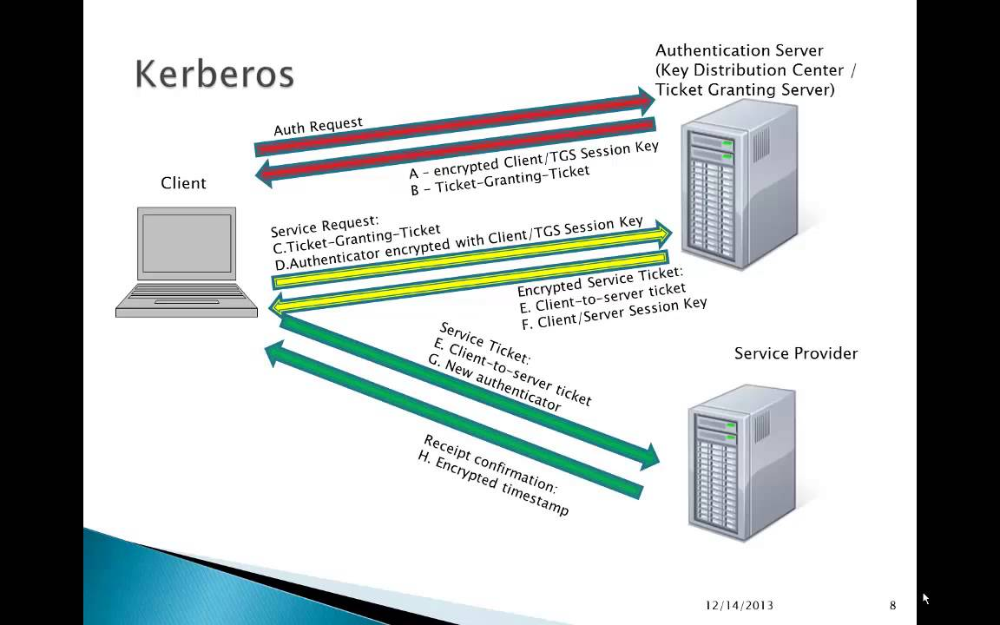

### Kerberos authentication

### OAuth2
https://tools.ietf.org/html/rfc6749

### SSO

单点登录（ Single Sign-On , 简称 SSO ）是目前比较流行的服务于企业业务整合的解决方案之一， SSO 使得在多个应用系统中，用户只需要 登录一次 就可以访问所有相互信任的应用系统。
 
一般 SSO 体系主要角色有三种：

1、 User （多个）
 
2、 Web 应用（多个）
 
3、 SSO 认证中心（ 1 个 ）
 
SSO 实现模式一般包括以下三个原则：
 
1、   所有的认证登录都在 SSO 认证中心进行；
 
2、   SSO 认证中心通过一些方法来告诉 Web 应用当前访问用户究竟是不是已通过认证的用户；
 
3、   SSO 认证中心和所有的 Web 应用建立一种信任关系，也就是说 web 应用必须信任认证中心。（单点信任）
 
SSO 的主要实现方式有：
 
1、   共享 cookies
 
基 于共享同域的 cookie 是 Web 刚开始阶段时使用的一种方式，它利用浏览同域名之间自动传递 cookies 机制，实现两个域名之间系统令牌 传递问题；另外，关于跨域问题，虽然 cookies本身不跨域，但可以利用它实现跨域的 SSO 。如：代理、暴露 SSO 令牌值等。
 
缺点：不灵活而且有不少安全隐患，已经被抛弃。
 
2、   Broker-based( 基于经纪人 )
 
这 种技术的特点就是，有一个集中的认证和用户帐号管理的服务器。经纪人给被用于进一步请求的电子身份存取。中央数据库的使用减少了管理的代价，并为认证提供 一个公共和独立的 "第三方 " 。例如 Kerberos 、 Sesame 、 IBM KryptoKnight （凭证库思想 ) 等。 Kerberos是由麻省理工大学发明的安全认证服务，已经被 UNIX 和 Windows 作为 默认的安全认证服务集成进操作系统。
 
3、   Agent-based （基于代理人）
 
在 这种解决方案中，有一个自动地为不同的应用程序认证用户身份的代理程序。这个代理程序需要设计有不同的功能。比如，它可以使用口令表或加密密钥来自动地将 认证的负担从用户移开。代理人被放在服务器上面，在服务器的认证系统和客户端认证方法之间充当一个 " 翻译 "。例如 SSH 等。
 
4、   Token-based
 
例如 SecureID,WebID ，现在被广泛使用的口令认证，比如 FTP 、邮件服务器的登录认证，这是一种简单易用的方式，实现一个口令在多种应用当中使用。
 
5、   基于网关
 
6、   基于 SAML
 
SAML(Security Assertion Markup Language ，安全断言标记语言）的出现大大简化了 SSO ，并被 OASIS 批准为 SSO 的执行标准 。开源组织 OpenSAML 实现了 SAML 规范。

### CAS
CAS （ Central Authentication Service ） 是 Yale 大学发起的一个企业级的、开源的项目，旨在为 Web 应用系统提供一种可靠的单点登录解决方法（属于 Web SSO ）。
 
主要特性
 
1、   开源的、多协议的 SSO 解决方案； Protocols ： Custom Protocol 、 CAS 、 OAuth 、 OpenID 、 RESTful API 、 SAML1.1 、 SAML2.0 等。
 
2、   支持多种认证机制： Active Directory 、 JAAS 、 JDBC 、 LDAP 、 X.509 Certificates 等；
 
3、   安全策略：使用票据（ Ticket ）来实现支持的认证协议；
 
4、   支持授权：可以决定哪些服务可以请求和验证服务票据（ Service Ticket ）；
 
5、   提 供高可用性：通过把认证过的状态数据存储在 TicketRegistry 组件中，这些组件有很多支持分布式环境的实现， 如： BerkleyDB 、 Default 、 EhcacheTicketRegistry 、 JDBCTicketRegistry 、 JBOSS TreeCache 、 JpaTicketRegistry 、 MemcacheTicketRegistry 等；
 
6、   支持多种客户端： Java 、 .Net 、 PHP 、 Perl 、 Apache, uPortal 等。

https://www.cnblogs.com/gy19920604/p/6029210.html
