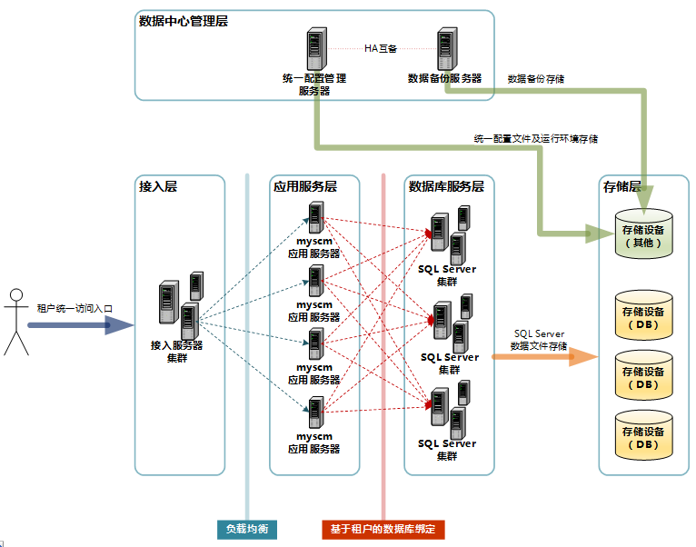

## 多租户Web设计

## 基于业务中台的多租户权限管理设计方案

http://www.woshipm.com/pd/2956772.html/comment-page-1

租户管理包含很多方面，如：

1）自主注册、订阅

2）计费、优惠策略

3）租户监控、管理

4）服务水平协议（SLA）管理

一般的单体应用的后台中权限管理的大体模式

整体的业务逻辑如下：

1. 系统中的菜单、页面、按钮、字段以及运行时产生的数据都需要注册成为系统资源；
2. 系统资源打包组合成为角色；
3. 角色可以关联用户，也就完成了资源授权给用户的处理
4. 角色可以关联用户组，而用户组是多个用户组合而成的一个集合，用户能够继承用户组关联的角色

而在系统运行时，任何一个用户在使用系统资源时，都需要进行授权校验，也就是看这个用户关联的所有的角色囊括的资源是否包涵当前要访问的资源，如此就完成了用户权限管理的控制。

你没有看错，所有的单体应用的权限管理的实现逻辑都是如此。

但在基于业务中台的基础之上去做权限管理的设计我们需要额外引入更多的概念（租户、应用实例等）以完成业务逻辑。

所有中台建设的目的都是为了业务快速且低成本创新，绝大部分的企业基于中台都会开发大量的业务应用，一般基于业务中台的架构如下图：

在基于中台的多租户、多应用的场景下，我们做权限管理的设计面临如下主要问题：

1. 在出厂时需要提供特殊的初始化权限管理流程；
2. 对于购买SaaS产品的客户而言，权限需要集中进行管理，以减少运营人员的工作内容；
3. 对于不同的角色/场景有不同的权限管理的需求。

整体产品架构：

业务中台是我们所有应用的基础设施，我们能够通过MPC 配置各个应用所需要的业务能力，把业务能力组合起来就能形成一个应用，如此我们实现了业务中台的能力复用以及快速支撑业务创新。

在这个业务模式中，应用均是通过配置在进行一定的前端页面开发形成，我们可以为每个租户生产其所需要的应用实例，租户下的数据是隔离的。

在客户购买我们整个标准产品后（包括业务中台、MPC、BOC以及预置应用），首先我们在MPC中预置了一个root账户，通过该账户我能够创建租户，并为租户实例化应用，在实例化应用的同时，为该租户生成在该应用实例下的租户管理员。

租户管理员能够进入BOC进行全局的权限管理，例如：他能在该租户下创建用户，并设置该用户能够登录的应用；他能为租户下的任一应用实例创建角色，并把该角色分配租户下的用户。

租户管理员管理权限的模式如下：

整体业务逻辑：

1. 系统初始化时，需要生成root账号，该账号由系统预置所有资源权限
2. root账号能够创建租户，并为租户实例化应用
3. 实例化应用的时候需要为租户生成租户管理员并赋予租户管理员该应用实例的管理员权限（管理员角色为应用预置）

租户是在SaaS模式下隔离数据使用，在数据层面有自己的独立空间；

应用实例指的是租户数据空间中运行的应用；用户是使用系统的直接对象，其能够使用资源是由其关联的角色决定；资源指的是系统中的菜单、页面、按钮、字段以及运行时产生的数据.

##

大数据集群可以被多个租户所使用；

集群管理员创建租户，为各个租户分配资源和空间配额，并指定各租户的租户管理员。

租户管理员可以创建项目，把资源进一步分配给各个项目，并指定项目管理员；

项目管理员对项目成员进行管理，项目的资源可以由项目成员共享，也可以通过Sentry/Ranger做进一步的权限管控。

## WEB项目——多租户

（1）概念：这里的多租户是指，从WEB操作菜单级别控制租户之间不可以相互访问，私有资源独立。

（2）实现方案：采用SPRING框架进行跳转过滤，限制不同租户访问WEB系统的菜单权限。

（3）应用场景:不同租户由于缴费情况不同或者开通的菜单功能不同，故需要隔离

## 将 web 应用程序转换为 SaaS 应用程序
要将您的 web 应用程序转换为 SaaS 应用程序，需要满足以下 7 个条件：

应用程序必须支持多租户  
应用程序必须具备某种程度的自助注册功能。  
必须具备订阅/记账机制。  
应用程序必须能够有效地扩展。  
必须能够监视、配置和管理应用程序和租户。  
必须有一种机制能够支持惟一的用户标识和身份验证。  
必须有一种机制能够支持对每个租户进行某种程度的自定义。  
让我们逐个地详细了解这 7 个条件。  

https://www.ibm.com/developerworks/cn/cloud/library/cl-multitenantsaas/index.html

- 对每个租户进行自定义
必须提供一种机制来支持对每个租户进行一定程度的基本自定义，从而使它们具有惟一的 URL、登入页面、标识、配色方案、字体，甚至包括语言。

对每个租户的基本配置是预期的功能，但是要真正地满足多租户的需求，必须在基本配置的基础上对每个租户实现一定程度的自定义。

所需的典型定制类似于租户对内部应用程序版本所作出的定制。包括添加字段甚至是表格，设置特殊的业务逻辑，或集成另一种应用程序。在每个租户的基础上能够进行这类自定义，同时无需建立单独的实例（否则会降低多租户设计的效率），这就是高性能 SaaS 架构的典型特征。

