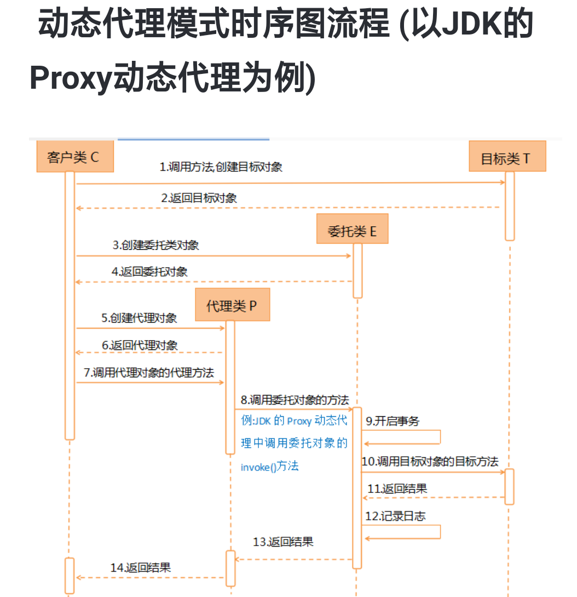
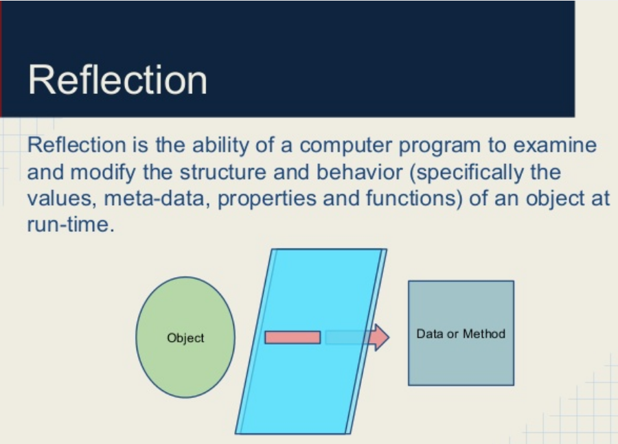
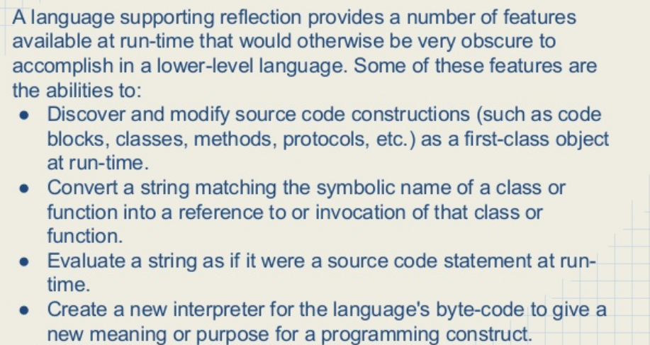
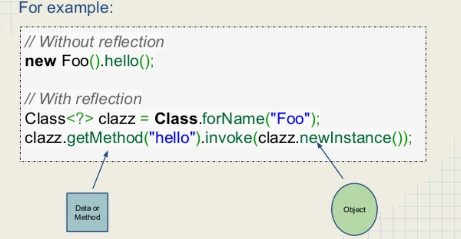
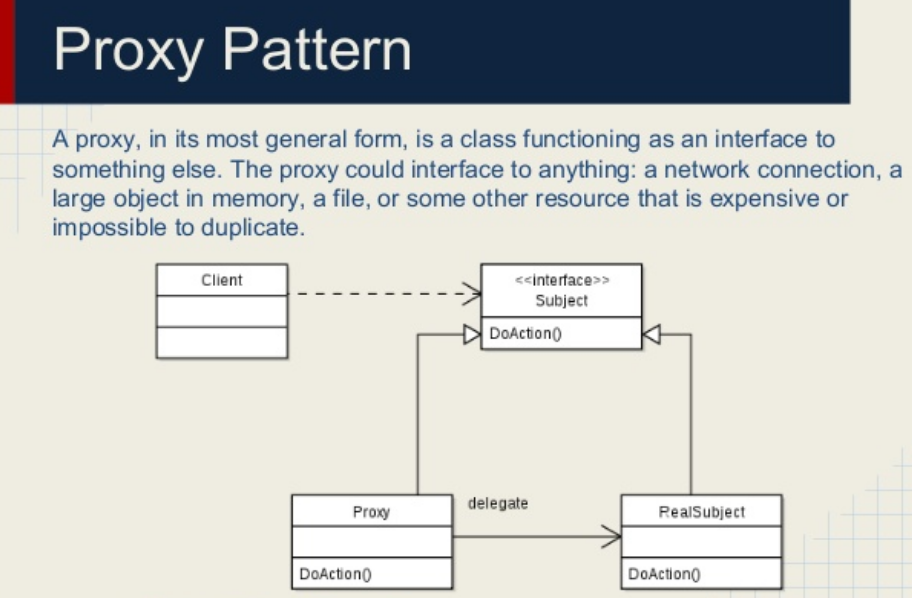
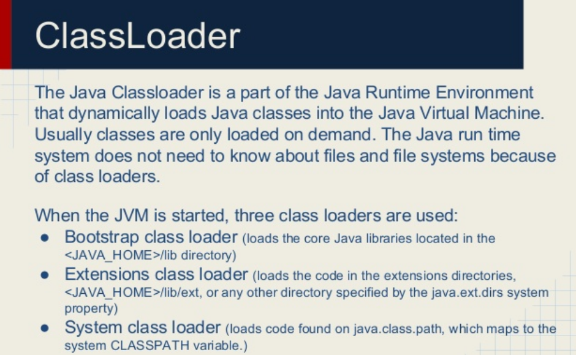

# Proxy Pattern

Proxy Pattern provides the control for accessing the original object.

## Scenario
 - Virtual Proxy
 - Protective Proxy
 - Remote Proxy
 - Smart Proxy

---


---

## 动态代理

动态代理：在程序运行时，运用反射机制动态创建而成。


动态代理模式中的代理类是由工具类或工厂类动态生成的，而不是由程序员手工定义的。代理关系是在程序运行过使用过程中确立的。


使用动态代理模式的目的是：在不修改目标类的前提下，增强目标对象。


```java
package proxy;
import java.lang.reflect.InvocationHandler;
import java.lang.reflect.InvocationTargetException;
import java.lang.reflect.Method;
import java.lang.reflect.Proxy;
public class JdkProxyDemo {
    interface If {
        void originalMethod(String s);
    }
    static class Original implements If {
        public void originalMethod(String s) {
            System.out.println(s);
        }
    }
    static class Handler implements InvocationHandler {
        private final If original;
        public Handler(If original) {
            this.original = original;
        }
        public Object invoke(Object proxy, Method method, Object[] args)
                throws IllegalAccessException, IllegalArgumentException,
                InvocationTargetException {
            System.out.println("BEFORE");
            method.invoke(original, args);
            System.out.println("AFTER");
            return null;
        }
    }
    public static void main(String[] args){
        Original original = new Original();
        Handler handler = new Handler(original);
        If f = (If) Proxy.newProxyInstance(If.class.getClassLoader(),
                new Class[] { If.class },
                handler);
        f.originalMethod("Hallo");
    }
}
```
上面使用了JDK的反射package.

Even though the proxy pattern does not only apply to situations when the proxy object and proxy class is created during run-time, this is an especially interesting topic in Java. In this article, I will focus on these proxies.

This is an advanced topic because it requires the use of the reflection class, or bytecode manipulation or compiling Java code generated dynamically. Or all of these. To have a new class not available as a bytecode yet during run-time will need the generation of the bytecode, and a class loader that loads the bytecode. To create the bytecode, you can use cglib or bytebuddy or the built-in Java compiler.

When we think about the proxy classes and the handlers they invoke, we can understand why the separation of responsibilities, in this case, is important. The proxy class is generated during run-time, but the handler invoked by the proxy class can be coded in the normal source code and compiled along the code of the whole program (compile time).

https://dzone.com/articles/java-dynamic-proxy

https://www.programering.com/a/MzMykzMwATY.html

---



---













