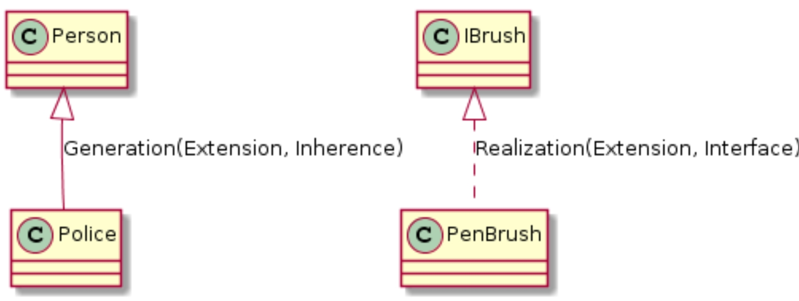
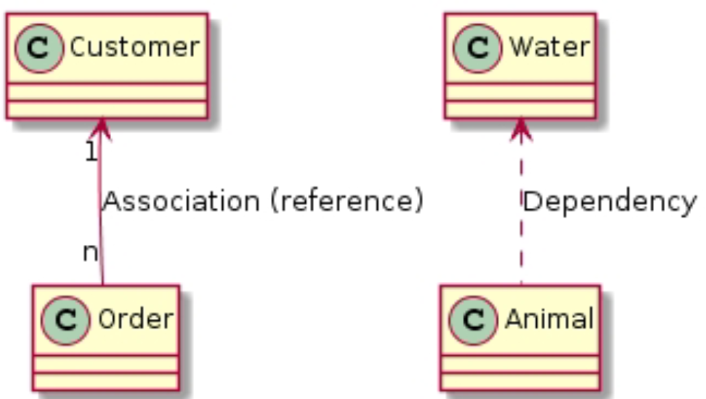
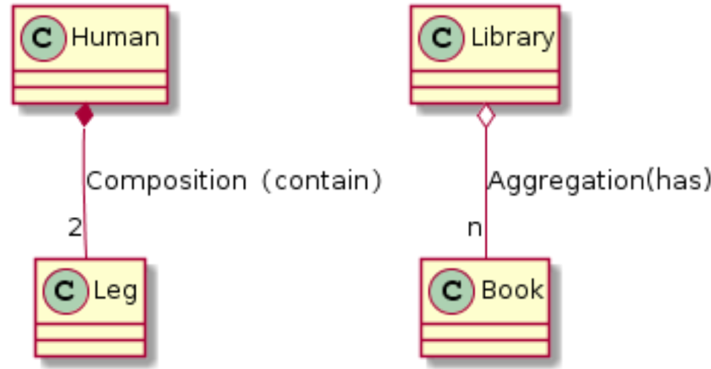

# UML

---

---

---
@startuml

Person  <|-- Police : Generation(Extension, Inherence)
IBrush  <|.. PenBrush : Realization(Extension, Interface)

class Customer
class Order
Customer "1" <-- "n" Order  : Association (reference)
Water  <..  Animal  : Dependency

Human    *-- "2" Leg    : Composition（contain）
Library  o-- "n" Book   : Aggregation(has)

ClassA .. ClassB :link
ClassC -- ClassD :link

@enduml
