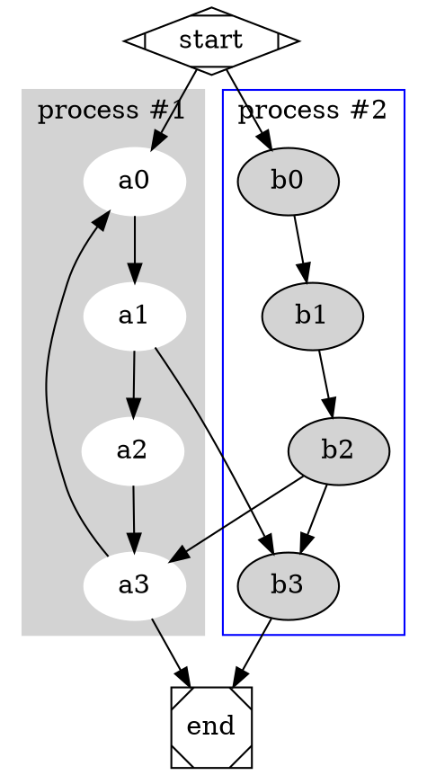
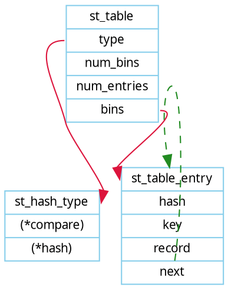
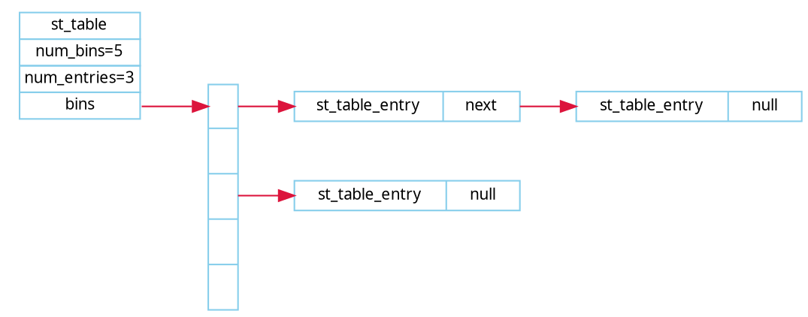
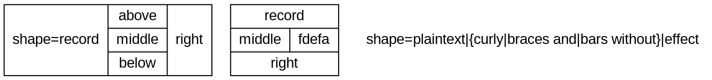
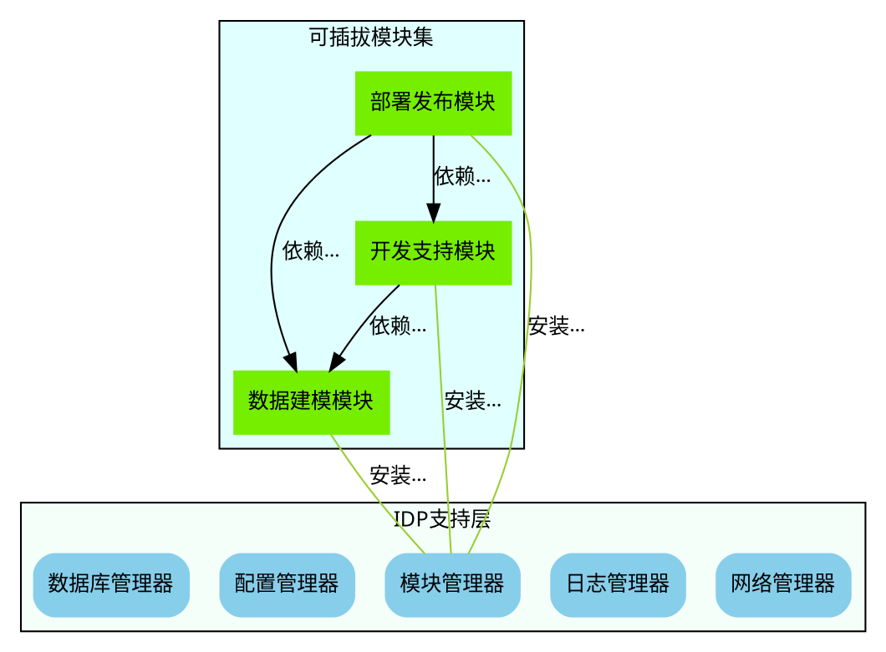
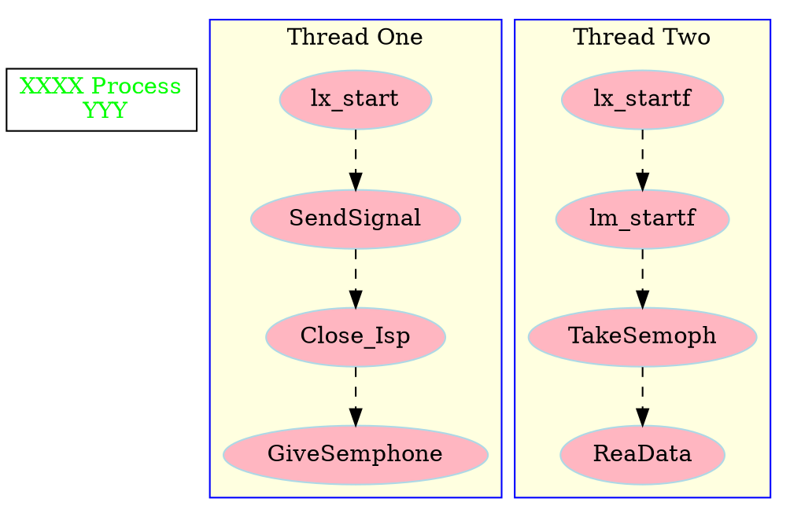

```dot
digraph H {

  aHtmlTable [
   shape=plaintext
   color=black1       // The color of the border of the table
   label=<

     <table border='0' cellborder='1' cellspacing='0'>
       <tr><td>col 1</td><td>foo</td></tr>
       <tr><td>COL 2</td><td>bar</td></tr>
     </table>

  >];

}
```

https://renenyffenegger.ch/notes/tools/Graphviz/examples/index


```puml
digraph R {
  rankdir=LR
  node [style="filled"]
  node1 [fillcolor=orange,shape=box]
  User [label="User", fillcolor=orange,shape=box]
  node2 [fillcolor=yellow, style="rounded,filled", shape=diamond]
  UserService [label="User service", shape=octagon,fillcolor=darkgreen,fontcolor=white]
  User->UserService
  
}
```


```puml
class fff extends aaa implements aaa{
    int fff;
}
```



















