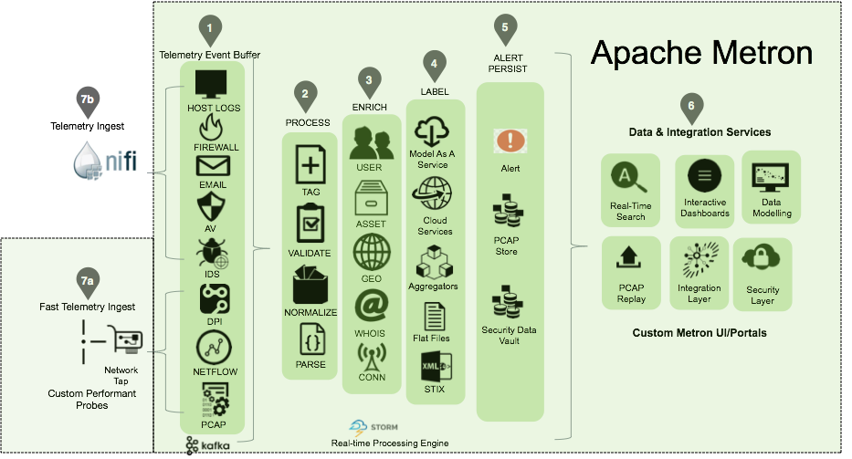
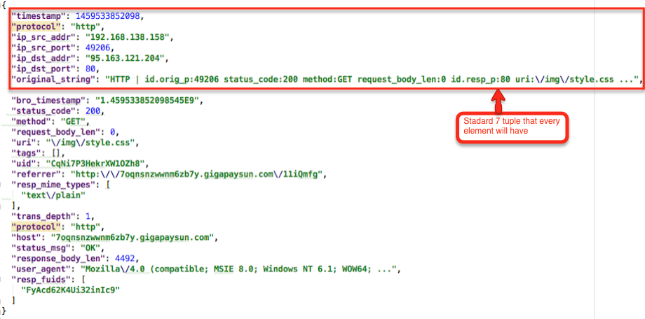
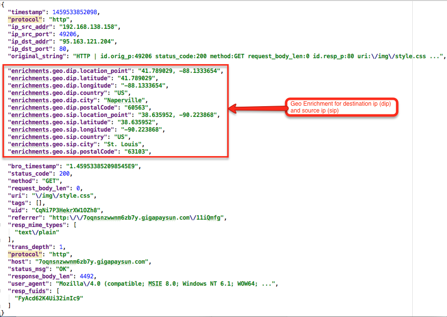
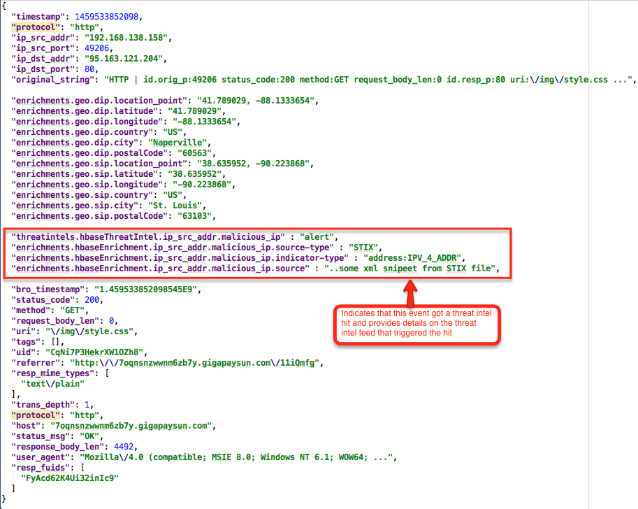
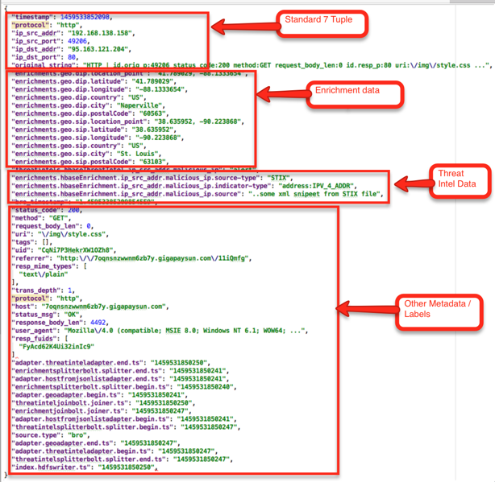
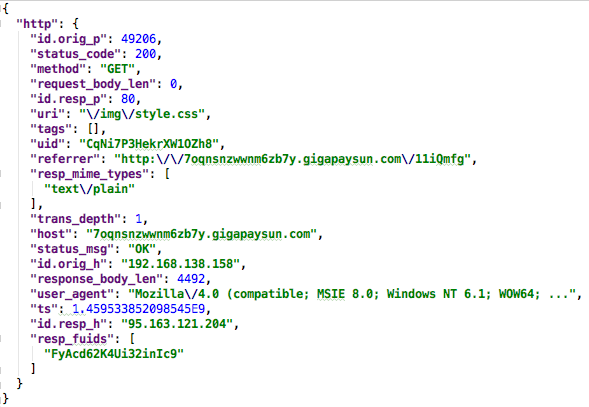
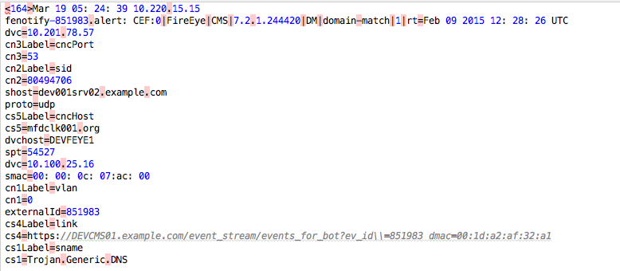

# Metron+ Architecture

## Metron Logical Architecture

## Step 1 - Telemetry Event Buffer

All raw events from each telemetry security data source captured by Apache Nifi or custom Metron probe will be pushed into its own Kafka topic. The arrival of a telemetry event into the ingest buffer marks the start of where the Metron processing begins.

## Step 2 - Process (Parse, Normalize, Validate and Tag)

Each raw event will be parsed and normalized into a standardized flat JSON structure. Every event will be standardized into at least a 7-tuple JSON structure. This is done so the topology correlation engine further downstream can correlate messages from different topologies by these fields. The standard field names are as follows:

- ip_src_addr: layer 3 source IP
- ip_dst_addr: layer 3 dest IP
- ip_src_port: layer 4 source port
- ip_dst_port: layer 4 dest port
- protocol: layer 4 protocol
- timestamp (epoch)
- original_string: A human friendly string representation of the message

At this step, one can also validate the raw event and tag it with additional metadata which will be used by downstream processing.

After Step 2, the raw Bro event will look like the following:

## Step 3 - Enrich

Once the raw security telemetry event has been parsed and normalized, the next step is to enrich different data elements of the normalized event. Examples of enrichment are GEO where an external IP address is enriched with GeoIP information (lat/long coordinates + City/State/Country) or HOST enrichment where an IP gets enriched with Host details (e.g: IP corresponds to Host X which is part of a web server farm for an e-commerce application).

After Step 4, the enriched Bro event will look something like the following:

## Step 4 - Label
After enrichment, the telemetry event goes through the labeling process. Actions done within this phase include threat intel cross reference checks where elements within the telemetry event can be used to do look ups against threat intel feed data sources like Soltra produced Stix/Taxii feeds or other threat intel aggregator services. These threat intel services will then “label” the telemetry event with threat intel metadata when a hit occurs.

Other types of services include executing/scoring analytical models using model as a service pattern with the telemetry events that are flowing in (more details on Analytical Models/Packs and Model as Service patterns will be coming in upcoming blogs of this series).

After step 4 assuming the bro telemetry event had a threat intel hit, the message would look something like the following:

    Structured Threat Information eXpression (STIX)
    
    结构化威胁信息表达式

    https://stixproject.github.io/

    Trusted Automated eXchange of Indicator Information(TAXII)

    https://taxiiproject.github.io/

## Step 5 - Alert and Persist
During this phase, certain telemetry events can initiate alerts. These types of telemetry events are then indexed in an alert index store. A telemetry event can spawn an alert triggered by a number of factors including:

- The event type - The raw telemetry event itself is an alert. For example, any event generated by Snort is an alert so it will automatically be indexed as an alert.
- Threat intel hit - If raw telemetry event has a threat intel hit, it will be marked as an alert.
Also during this step, all enriched and labeled telemetry events are indexed and persisted in Hadoop for long term storage. The storage of these events in Hadoop produces a security data vault within the enterprise that enables next generation analytics to be performed.

After step 5, the telemetry event is stored in HDFS and indexed in Elastic/Solr based on configuration. The persisted event in HDFS looks something like the following:

## Step 6 - UI Portal and Data & Integration Services
Steps 1 through 6 provide the mechanism to ingest, parse, normalize, enrich, label, index and store all security telemetry data across a diverse set of data sources in your enterprise into a single security data vault. This allows the Metron platform to provide a set of services for different types of security users to perform their jobs more effectively. Some of these services include:

- Real-time Search and Interactive Dashboards / Portals - Single Pane of glass for security operation analysts to view alerts and correlate alerts to the granular telemetry events that caused the alert.
- Data Modeling / Feature Engineering Services - Since the Metron framework normalizes and enriches the data and stores it into the security data lake (HDFS, Hbase) in standardized locations, then various analytical models can be provided by the platform. These models will have specifications for the feature matrix required, and hence, the process of feature engineering which is the most complex aspect of analytics becomes considerably simplified. Data Modeling services required for the feature matrix will be provided by tools such as Jupyter, IPython and Zeppelin.

  - Integration and Extensibility Layers - One of the most powerful features of the Metron platform is the ability to customize it for your own needs/requirements which includes:
  - Ingesting new data sources
  - Adding new parsers
  - Adding new enrichment services
  - Adding new Threat Intel feeds
  - Building, deploying and executing new analytical models
  - Integration with enterprise workflow engin

## Step 7a - Fast Telemetry Ingest
For high volume network telemetry data like packet capture (PCAP), Netflow/YAF, and Bro/DPI, custom Metron probes will be available to ingest data directly from a network tap.

An example would be capturing Bro data using the custom C++ Metron probe. The raw Bro event captured by the Bro probe would look something like the following:

## Step 7b - Telemetry Ingest
For most security telemetry data sources that uses transports and protocols like file, syslog, REST, HTTP, custom API, etc., Metron will use Apache Nifi to ingest data at the source.

An example would be capturing data from a FireEye appliance with Nifi’s SysLog Processor. The raw Fireye event captured would look something like the following:

