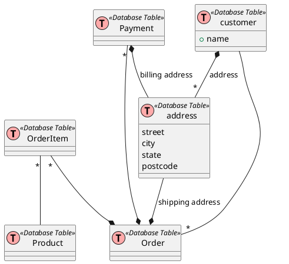

## Denormalization: When, Why, and How
http://www.vertabelo.com/blog/technical-articles/denormalization-when-why-and-how 
Denormalization is a strategy used on a previously-normalized database to increase performance. The idea behind it is to add redundant data where we think it will help us the most. We can use extra attributes in an existing table, add new tables, or even create instances of existing tables. The usual goal is to decrease the running time of select queries by making data more accessible to the queries or by generating summarized reports in separate tables. 

What Are the Disadvantages of Denormalization?
Obviously, the biggest advantage of the denormalization process is increased performance. But we have to pay a price for it, and that price can consist of:

Disk space: This is expected, as we’ll have duplicate data.
Data anomalies: We have to be very aware of the fact that data now can be changed in more than one place. We must adjust every piece of duplicate data accordingly. That also applies to computed values and reports. We can achieve this by using triggers, transactions and/or procedures for all operations that must be completed together.
Documentation: We must properly document every denormalization rule that we have applied. If we modify database design later, we’ll have to look at all our exceptions and take them into consideration once again. Maybe we don’t need them anymore because we’ve solved the issue. Or maybe we need to add to existing denormalization rules. (For example: We added a new attribute to the client table and we want to store its history value together with everything we already store. We’ll have to change existing denormalization rules to achieve that).
Slowing other operations: We can expect that we’ll slow down data insert, modification, and deletion operations. If these operations happen relatively rarely, this could be a benefit. Basically, we would divide one slow select into a larger number of slower insert/update/delete queries. While a very complex select query technically could noticeably slow down the entire system, slowing down multiple “smaller” operations should not damage the usability of our application.
More coding: Rules 2 and 3 will require additional coding, but at the same time they will simplify some select queries a lot. If we’re denormalizing an existing database we’ll have to modify these select queries to get the benefits of our work. We’ll also have to update values in newly-added attributes for existing records. This too will require a bit more coding.

## Example of Aggregation Model

### 6 Rules of Thumb for MongoDB Schema Design
https://www.mongodb.com/blog/post/6-rules-of-thumb-for-mongodb-schema-design-part-1
https://www.mongodb.com/blog/post/6-rules-of-thumb-for-mongodb-schema-design-part-2

### NOSQL DATA MODELING TECHNIQUES
https://highlyscalable.wordpress.com/2012/03/01/nosql-data-modeling-techniques/

### Data Modeling Guidelines for NoSQL JSON Document Databases
https://mapr.com/blog/data-modeling-guidelines-nosql-json-document-databases/

### NoSQL Data Modeling
https://www.ebayinc.com/stories/blogs/tech/nosql-data-modeling/

