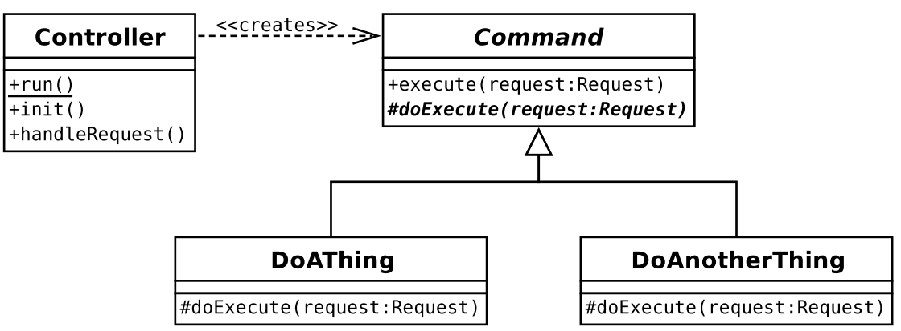
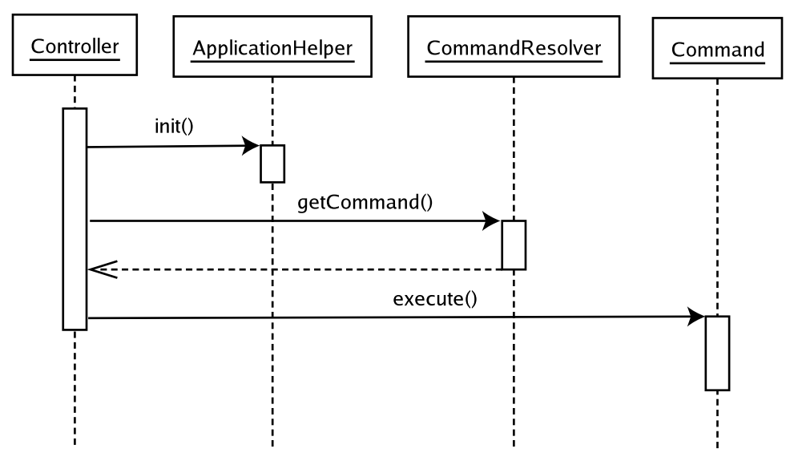
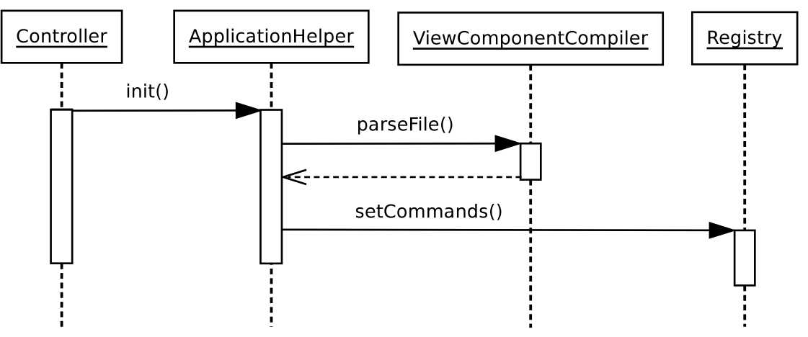
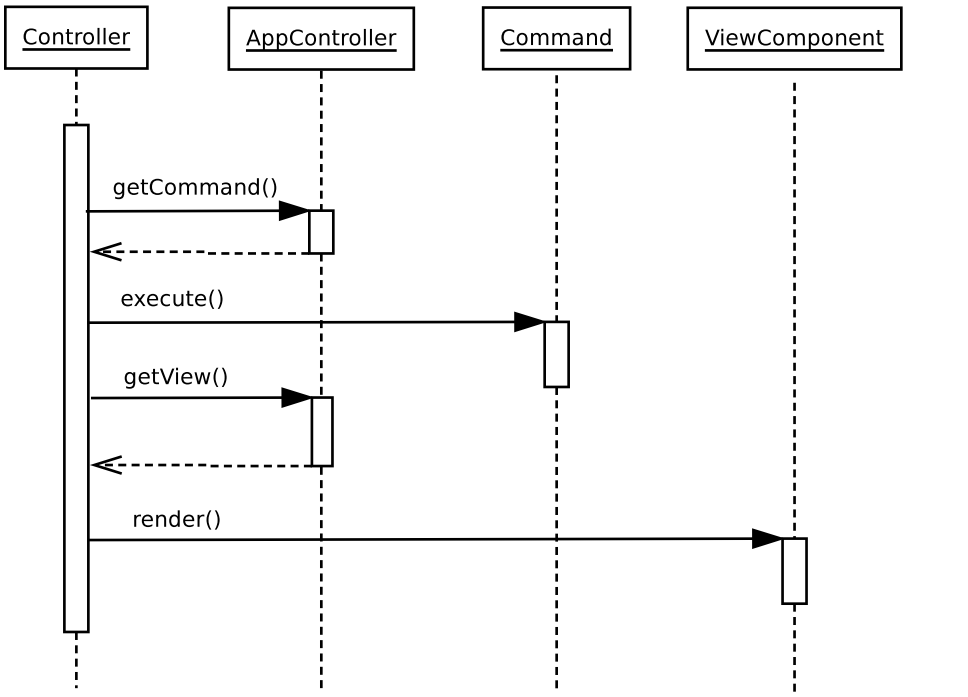
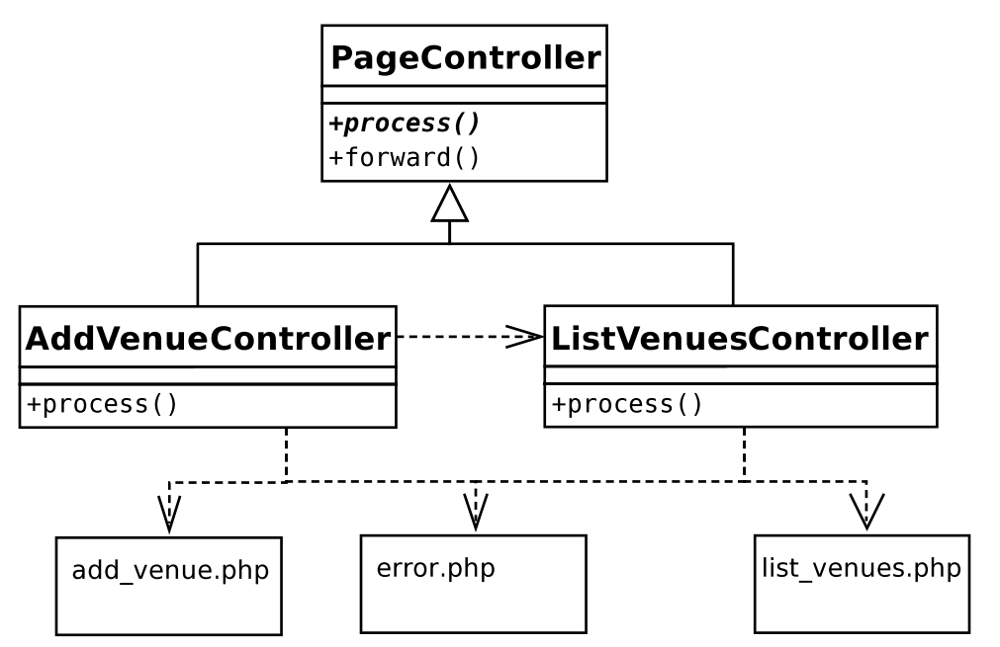
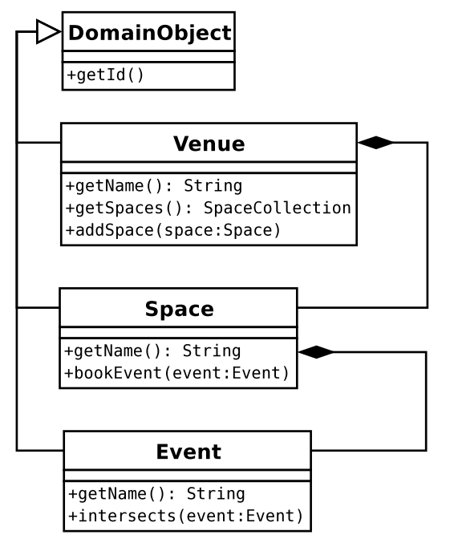

## 1. Applications and Layers

Ddecoupling. By keeping business logic independent of the view layer, you make it possible to add new interfaces to your system with little or no rewriting.

- 每个层都有独立清晰的接口
- 每个层都可以独立的测试。
- 避免全局的变量引用。

## 2.Registry
The Registry pattern provides an alternative that is not without its own consequences.

A registry is simply a class that provides access to data (usually, but not exclusively, objects) via static 
methods (or via instance methods on a singleton). Every object in a system, therefore, has access to these 
objects.

```php
$reg = Registry::instance();
print_r($reg->getRequest());
```
## 3.Controller







## 4.Domain Model
The Domain Model is the pristine logical engine that many of the other patterns in this chapter strive to create, nurture, and protect. It is an abstracted representation of the forces at work in your project. It’s a kind of plane of forms, where your business problems play out their nature unencumbered by nasty material issues like databases and web pages.

If that seems a little flowery, let’s bring it down to reality. A Domain Model is a representation of the real-world participants of your system. It is in the Domain Model that the object-as-thing rule of thumb is truer than elsewhere. Everywhere else, objects tend to embody responsibilities. In the Domain Model, they often describe a set of attributes, with added agency. They are things that do stuff.



```php
// listing 12.44
abstract class DomainObject
{
    private $id;

    public function __construct(int $id)
    {
        $this->id = $id;
    }
    public function getId(): int
    {
        return $this->id;
    }
    public static function getCollection(string $type): Collection
    {
        // dummy implementation
        return Collection::getCollection($type);
    }
    public function markDirty()
    {
        // next chapter!
    }
}
// listing 12.45
class Venue extends DomainObject
{
    private $name;
    private $spaces;
    public function __construct(int $id, string $name)
    {
        $this->name = $name;
        $this->spaces = self::getCollection(Space::class);
        parent::__construct($id);
    }
    public function setSpaces(SpaceCollection $spaces)
    {
        $this->spaces = $spaces;
    }
    public function getSpaces(): SpaceCollection
    {
        return $this->spaces;
    }
    public function addSpace(Space $space)
    {
        $this->spaces->add($space);
        $space->setVenue($this);
    }    public function setName(string $name)
    {
        $this->name = $name;
        $this->markDirty();
    }
    public function getName(): string
    {
        return $this->name;
    }
}
//-------------------------------------------------
$this->spaces = self::getCollection(Space::class);
```

