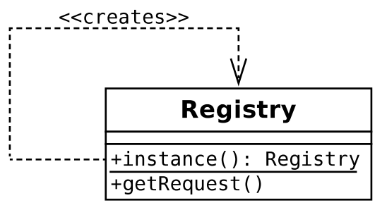

## 1. Applications and Layers

Ddecoupling. By keeping business logic independent of the view layer, you make it possible to add new interfaces to your system with little or no rewriting.

- 每个层都有独立清晰的接口
- 每个层都可以独立的测试。
- 避免全局的变量引用。

### Registry
The Registry pattern provides an alternative that is not without its own consequences.

A registry is simply a class that provides access to data (usually, but not exclusively, objects) via static 
methods (or via instance methods on a singleton). Every object in a system, therefore, has access to these 
objects.

···php
$reg = Registry::instance();
print_r($reg->getRequest());
···
