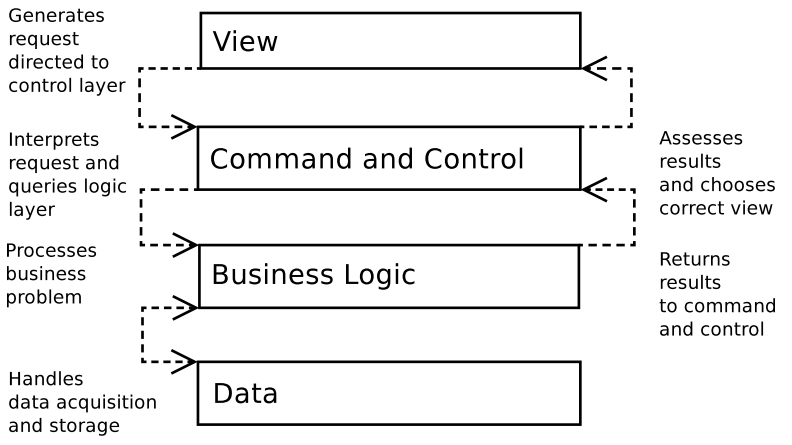

## 1. Applications and Layers

Ddecoupling. By keeping business logic independent of the view layer, you make it possible to add new interfaces to your system with little or no rewriting.

- 每个层都有独立清晰的接口
- 每个层都可以独立的测试。
- 避免全局的变量引用。

## 2.Registry
The Registry pattern provides an alternative that is not without its own consequences.

A registry is simply a class that provides access to data (usually, but not exclusively, objects) via static 
methods (or via instance methods on a singleton). Every object in a system, therefore, has access to these 
objects.

```php
$reg = Registry::instance();
print_r($reg->getRequest());
```
## 3.Controller


## 4.Domain Model
The Domain Model is the pristine logical engine that many of the other patterns in this chapter strive to create, nurture, and protect. It is an abstracted representation of the forces at work in your project. It’s a kind of plane of forms, where your business problems play out their nature unencumbered by nasty material issues like databases and web pages.

If that seems a little flowery, let’s bring it down to reality. A Domain Model is a representation of the real-world participants of your system. It is in the Domain Model that the object-as-thing rule of thumb is truer than elsewhere. Everywhere else, objects tend to embody responsibilities. In the Domain Model, they often describe a set of attributes, with added agency. They are things that do stuff.


```php
// listing 12.44
abstract class DomainObject
{
    private $id;

    public function __construct(int $id)
    {
        $this->id = $id;
    }
    public function getId(): int
    {
        return $this->id;
    }
    public static function getCollection(string $type): Collection
    {
        // dummy implementation
        return Collection::getCollection($type);
    }
    public function markDirty()
    {
        // next chapter!
    }
}
// listing 12.45
class Venue extends DomainObject
{
    private $name;
    private $spaces;
    public function __construct(int $id, string $name)
    {
        $this->name = $name;
        $this->spaces = self::getCollection(Space::class);
        parent::__construct($id);
    }
    public function setSpaces(SpaceCollection $spaces)
    {
        $this->spaces = $spaces;
    }
    public function getSpaces(): SpaceCollection
    {
        return $this->spaces;
    }
    public function addSpace(Space $space)
    {
        $this->spaces->add($space);
        $space->setVenue($this);
    }    public function setName(string $name)
    {
        $this->name = $name;
        $this->markDirty();
    }
    public function getName(): string
    {
        return $this->name;
    }
}
//-------------------------------------------------
$this->spaces = self::getCollection(Space::class);
```


主流框架的优缺点总结


### ThinkPHP

ThinkPHP(FCS)是一个轻量级的中型框架，是从Java的Struts结构移植过来的中文PHP开发框架。它使用面向对象的开发结构和MVC模式，并且模拟实现了Struts的标签库，各方面都比较人性化，熟悉J2EE的开发人员相对比较容易上手，适合php框架初学者。 ThinkPHP的宗旨是简化开发、提高效率、易于扩展，其在对数据库的支持方面已经包括MySQL、MSSQL、Sqlite、PgSQL、 Oracle，以及PDO的支持。ThinkPHP有着丰富的文档和示例，框架的兼容性较强，但是其功能有限，因此更适合用于中小项目的开发。

推荐课程：《最新ThinkPHP 5.1全球首发视频教程》

优点：

1.易于上手，有丰富的中文文档；

2.框架的兼容性较强，PHP4和PHP5完全兼容、完全支持UTF8等。

3. 适合用于中小项目的开发

缺点：

1.对Ajax的支持不是很好；

2.目录结构混乱，需要花时间整理；

3.上手容易，但是深入学习较难。

### Yii

Yii 是一个基于组件的高性能php框架，用于开发大型Web应用。Yii采用严格的OOP编写，并有着完善的库引用以及全面的教程。从 MVC，DAO/ActiveRecord，widgets，caching，等级式RBAC，Web服务，到主题化，I18N和L10N，Yii提供了 今日Web 2.0应用开发所需要的几乎一切功能。事实上，Yii是最有效率的PHP框架之一。

推荐课程：《Yii开发大型商城项目视频教程》

优点：

纯OOP

用于大规模Web应用

模型使用方便

开发速度快，运行速度也快。性能优异且功能丰富

使用命令行工具。

缺点：

对Model层的指导和考虑较少

文档实例较少

英文太多

要求PHP技术精通，OOP编程要熟练！

View并不是理想view，理想中的view可能只是html代码，不会涉及PHP代码。

### CodeIgniter

优点：

Code Igniter推崇“简单就是美”这一原则。没有花哨的设计模式、没有华丽的对象结构，一切都是那么简单。几行代码就能开始运行，再加几 行代码就可以进行输出。可谓是“大道至简”的典范。 配置简单，全部的配置使用PHP脚本来配置，执行效率高；具有基本的路由功能，能够进行一定程度的路 由；具有初步的Layout功能，能够制作一定程度的界面外观；数据库层封装的不错，具有基本的MVC功能. 快速简洁，代码不多，执行性能高，框架简 单，容易上手，学习成本低，文档详细；自带了很多简单好用的library，框架适合小型应用.


缺点：

本身的实现不太理想。内部结构过于混乱，虽然简单易用，但缺乏扩展能力。 把Model层简单的理解为数据库操作. 框架略显简单，只能够满足小型应用，略微不太能够满足中型应用需要.


评价：

总体来说，拿CodeIgniter来完成简单快速的应用还是值得，同时能够构造一定程度的layout，便于模板的复用，数据操作层来说封装的不 错，并且CodeIgniter没有使用很多太复杂的设计模式，执行性能和代码可读性上都不错。至于附加的library 也还不错，简洁高效。

Lavarel 框架
优点：
Laravel 的设计思想是很先进的，非常适合应用各种开发模式TDD, DDD 和BDD，作为一个框
架，它准备好了一切，composer 是个php 的未来，没有composer，PHP 肯定要走向没落。
laravel 最大的特点和优秀之处就是集合了php 比较新的特性，以及各种各样的设计模式，
Ioc 容器，依赖注入等。

推荐课程：《最新laravel商城实战视频教程》

缺点：
基于组件式的框架，所以比较臃肿

