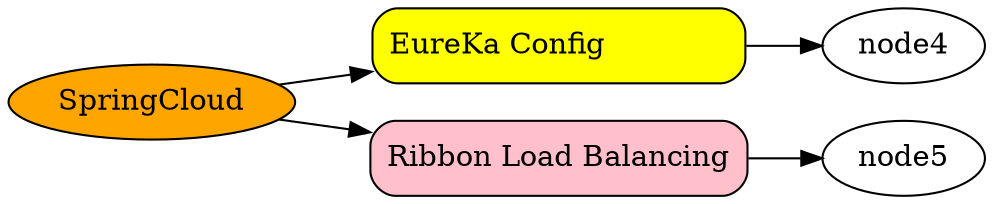

# SpringCloud
## Spring Cloud Netflix
### Eureka Config Center
### Hystrix Circuit Breaker & Degrade
### Zuul MS Gateway
### Netflix Archaius
## SpringCloud Config
## SpringCloud Bus
## SpringCloud Cluster
## SpringCloud Consul
## SpringCloud Security
## SpringCloud Sleuth
## SpringCloud Data Flow
## SpringCloud Stream
## SpringCloud Task
## SpringCloud Zookeeper
## Spring Cloud Connector
## Spring Cloud Starters
## Spring Cloud CLI

## Ribbon Load Balancing
## Fegion Service Call
## Distributed Config Center
## Sleuth
## Bus
## Hystrix Interface Degrade
## Spring Boot Integrate Spring Cloud

 ## FiveWeapon
SpringCloud分布式开发五大神兽
https://www.cnblogs.com/ilinuxer/p/6580998.html
 - Eureka

 - Ribbon负载均衡

 - Hystrix 断路器

 - Zuul 服务网管

 - Spring Cloud Config分布式配置

---

frontend ---gateway----eureka /service register -- service A  - service B
                                                \
                                                 \ service C

https://www.baeldung.com/spring-security-registration
https://github.com/Baeldung/spring-security-registration

#### spring jpa
Accessing H2 web console at /h2-console
