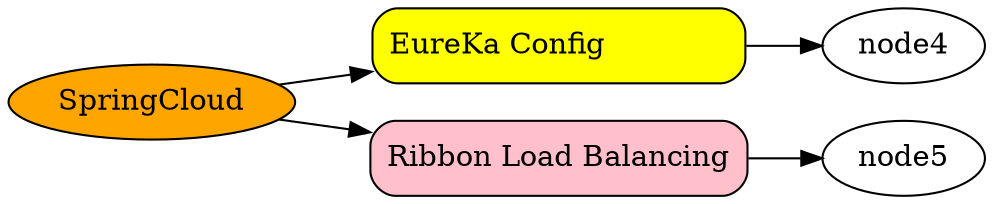

# SpringCloud
## Spring Cloud Netflix
### Eureka Config Center
### Hystrix Circuit Breaker & Degrade
### Zuul MS Gateway
### Netflix Archaius
## SpringCloud Config
## SpringCloud Bus
## SpringCloud Cluster
## SpringCloud Consul
## SpringCloud Security
## SpringCloud Sleuth
## SpringCloud Data Flow
## SpringCloud Stream
## SpringCloud Task
## SpringCloud Zookeeper
## Spring Cloud Connector
## Spring Cloud Starters
## Spring Cloud CLI

 Hystrix Interface Degrade
 Spring Boot Integrate Spring Cloud

 ## FiveWeapon
SpringCloud分布式开发五大神兽
https://www.cnblogs.com/ilinuxer/p/6580998.html
 - Eureka

 - Ribbon负载均衡

 - Hystrix 断路器

 - Zuul 服务网管

 - Spring Cloud Config分布式配置

## Feature
- Distributed/versioned configuration
- Service registration and discovery
- Routing
- Service-to-service calls
- Load balancing
- Circuit Breakers
- Global locks
- Leadership election and cluster state
- Distributed messaging

## Main Project
Spring Cloud Config
Centralized external configuration management backed by a git repository. The configuration resources map directly to Spring `Environment` but could be used by non-Spring applications if desired.

### Spring Cloud Netflix
Integration with various Netflix OSS components (Eureka, Hystrix, Zuul, Archaius, etc.).

### Spring Cloud Bus
An event bus for linking services and service instances together with distributed messaging. Useful for propagating state changes across a cluster (e.g. config change events).

### Spring Cloud for Cloud Foundry
Integrates your application with Pivotal Cloud Foundry. Provides a service discovery implementation and also makes it easy to implement SSO and OAuth2 protected resources.

### Spring Cloud Open Service Broker
Provides a starting point for building a service broker that implements the Open Service Broker API.

### Spring Cloud Cluster
Leadership election and common stateful patterns with an abstraction and implementation for Zookeeper, Redis, Hazelcast, Consul.

### Spring Cloud Consul
Service discovery and configuration management with Hashicorp Consul.

### Spring Cloud Security
Provides support for load-balanced OAuth2 rest client and authentication header relays in a Zuul proxy.

### Spring Cloud Sleuth
Distributed tracing for Spring Cloud applications, compatible with Zipkin, HTrace and log-based (e.g. ELK) tracing.

### Spring Cloud Data Flow
A cloud-native orchestration service for composable microservice applications on modern runtimes. Easy-to-use DSL, drag-and-drop GUI, and REST-APIs together simplifies the overall orchestration of microservice based data pipelines.

### Spring Cloud Stream
A lightweight event-driven microservices framework to quickly build applications that can connect to external systems. Simple declarative model to send and receive messages using Apache Kafka or RabbitMQ between Spring Boot apps.

### Spring Cloud Stream App Starters
Spring Cloud Stream App Starters are Spring Boot based Spring Integration applications that provide integration with external systems.

### Spring Cloud Task
A short-lived microservices framework to quickly build applications that perform finite amounts of data processing. Simple declarative for adding both functional and non-functional features to Spring Boot apps.

### Spring Cloud Task App Starters
Spring Cloud Task App Starters are Spring Boot applications that may be any process including Spring Batch jobs that do not run forever, and they end/stop after a finite period of data processing.

### Spring Cloud Zookeeper
Service discovery and configuration management with Apache Zookeeper.

### Spring Cloud for Amazon Web Services
Easy integration with hosted Amazon Web Services. It offers a convenient way to interact with AWS provided services using well-known Spring idioms and APIs, such as the messaging or caching API. Developers can build their application around the hosted services without having to care about infrastructure or maintenance.

### Spring Cloud Connectors
Makes it easy for PaaS applications in a variety of platforms to connect to backend services like databases and message brokers (the project formerly known as "Spring Cloud").

### Spring Cloud Starters
Spring Boot-style starter projects to ease dependency management for consumers of Spring Cloud. (Discontinued as a project and merged with the other projects after Angel.SR2.)

### Spring Cloud CLI
Spring Boot CLI plugin for creating Spring Cloud component applications quickly in Groovy

### Spring Cloud Contract
Spring Cloud Contract is an umbrella project holding solutions that help users in successfully implementing the Consumer Driven Contracts approach.

### Spring Cloud Gateway
Spring Cloud Gateway is an intelligent and programmable router based on Project Reactor.

### Spring Cloud OpenFeign
Spring Cloud OpenFeign provides integrations for Spring Boot apps through autoconfiguration and binding to the Spring Environment and other Spring programming model idioms.

### Spring Cloud Pipelines
Spring Cloud Pipelines provides an opinionated deployment pipeline with steps to ensure that your application can be deployed in zero downtime fashion and easilly rolled back of something goes wrong.

### Spring Cloud Function
Spring Cloud Function promotes the implementation of business logic via functions. It supports a uniform programming model across serverless providers, as well as the ability to run standalone (locally or in a PaaS).
---

frontend ---gateway----eureka /service register -- service A  - service B
                                                \
                                                 \ service C

https://www.baeldung.com/spring-security-registration
https://github.com/Baeldung/spring-security-registration

#### spring jpa
Accessing H2 web console at /h2-console

---

