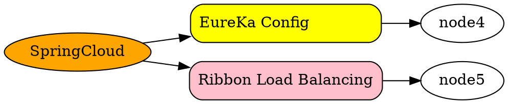

# SpringCloud
## Spring Cloud Netflix
### Eureka Config Center
### Hystrix Circuit Breaker & Degrade
https://github.com/Netflix/Hystrix/wiki
使用 Hystrix 实现自动降级与依赖隔离
cascading failure连锁失效
使用Hystrix实现自动降级与依赖隔离 
https://www.jianshu.com/p/138f92aa83dc
Hystrix其实一套command pattern（命令模式，行为模式的一种）的封装，要明白Hystrix的工作原理首先要明白command pattern ，关于command pattern 可以参考
http://design-patterns.readthedocs.io/zh_CN/latest/behavioral_patterns/command.html

命令模式的本质是对命令进行封装，将发出命令的责任和执行命令的责任分割开。

1.每一个命令都是一个操作：请求的一方发出请求，要求执行一个操作；接收的一方收到请求，并执行操作。
2.命令模式允许请求的一方和接收的一方独立开来，使得请求的一方不必知道接收请求的一方的接口，更不必知道请求是怎么被接收，以及操作是否被执行、何时被执行，以及是怎么被执行的。
3.命令模式使请求本身成为一个对象，这个对象和其他对象一样可以被存储和传递。
4.命令模式的关键在于引入了抽象命令接口，且发送者针对抽象命令接口编程，只有实现了抽象命令接口的具体命令才能与接收者相关联。

### Zuul MS Gateway
### Netflix Archaius
## SpringCloud Config
## SpringCloud Bus
## SpringCloud Cluster
## SpringCloud Consul
## SpringCloud Security
Spring Cloud Security features

■Relay SSO tokens from a front end to a back end service in a Zuul proxy

■Relay tokens between resource servers

■An interceptor to make a Feign client behave like OAuth2RestTemplate (fetching tokens etc.)

■Configure downstream authentication in a Zuul proxy

Single Sign On(All of the OAuth2 SSO and resource server features moved to Spring Boot in version 1.3. )
Token Relay

A Token Relay is where an OAuth2 consumer acts as a Client and forwards the incoming token to outgoing resource requests. The consumer can be a pure Client (like an SSO application) or a Resource Server.

■- Client Token Relay

■- Client Token Relay in Zuul Proxy

■- Resource Server Token Relay

## SpringCloud Sleuth
## SpringCloud Data Flow
## SpringCloud Stream
Spring Cloud Stream 本质精简概括，就是让员使用消息中间件变得简单。
Spring Cloud Stream 是一个为微服务应用构建消息驱动能力的框架。它基于Spring Boot创建独立的，可用于生产的Spring 应用程序。通过使用Spring Integration来连接消息代理中间件以实现消息事件驱动。Spring Cloud Stream 为消息中间件产品提供了个性化的自动化配置实现，引用了**发布-订阅、消费组、分区**的三个核心概念。目前仅支持RabbitMQ、Kafka。
## SpringCloud Task

Spring Cloud Task 主要解决短命微服务的任务管理，任务调度的工作，比如说某些定时任务晚上就跑一次，或者某项数据分析临时就跑几次。
https://www.baeldung.com/spring-cloud-task
https://www.jianshu.com/p/39573f2a5ec1
■ Spring Cloud Task的生命周期
在任务生命周期中，我们可以在TaskExecutionListener接口中注册侦听器。我们需要一个实现接口的类，它有三个方法 - 在Task的各个事件中触发onTaskEnd，onTaksFailed和onTaskStartup。
■ 与Spring Batch集成
可以将Spring Batch Job作为Task执行，并使用Spring Cloud Task记录Job执行的事件。
■ 从Stream启动任务
Launching a Task from Stream

## SpringCloud Zookeeper
## Spring Cloud Connector
## Spring Cloud Starters
## Spring Cloud CLI

 

 ## FiveWeapon
SpringCloud分布式开发五大神兽
https://www.cnblogs.com/ilinuxer/p/6580998.html
 - Eureka

 - Ribbon负载均衡

 - Hystrix 断路器

 - Zuul 服务网管

 - Spring Cloud Config分布式配置

## Feature
- Distributed/versioned configuration
- Service registration and discovery
- Routing
- Service-to-service calls
- Load balancing
- Circuit Breakers
- Global locks
- Leadership election and cluster state
- Distributed messaging

## Main Project
Spring Cloud Config
Centralized external configuration management backed by a git repository. The configuration resources map directly to Spring `Environment` but could be used by non-Spring applications if desired.

### Spring Cloud Netflix
Integration with various Netflix OSS components (Eureka, Hystrix, Zuul, Archaius, etc.).

### Spring Cloud Bus
An event bus for linking services and service instances together with distributed messaging. Useful for propagating state changes across a cluster (e.g. config change events).

### Spring Cloud for Cloud Foundry
Integrates your application with Pivotal Cloud Foundry. Provides a service discovery implementation and also makes it easy to implement SSO and OAuth2 protected resources.

### Spring Cloud Open Service Broker
Provides a starting point for building a service broker that implements the Open Service Broker API.

### Spring Cloud Cluster
Leadership election and common stateful patterns with an abstraction and implementation for Zookeeper, Redis, Hazelcast, Consul.

### Spring Cloud Consul
Service discovery and configuration management with Hashicorp Consul.

### Spring Cloud Security
Provides support for load-balanced OAuth2 rest client and authentication header relays in a Zuul proxy.

### Spring Cloud Sleuth
Distributed tracing for Spring Cloud applications, compatible with Zipkin, HTrace and log-based (e.g. ELK) tracing.

### Spring Cloud Data Flow
A cloud-native orchestration service for composable microservice applications on modern runtimes. Easy-to-use DSL, drag-and-drop GUI, and REST-APIs together simplifies the overall orchestration of microservice based data pipelines.

### Spring Cloud Stream
A lightweight event-driven microservices framework to quickly build applications that can connect to external systems. Simple declarative model to send and receive messages using Apache Kafka or RabbitMQ between Spring Boot apps.

### Spring Cloud Stream App Starters
Spring Cloud Stream App Starters are Spring Boot based Spring Integration applications that provide integration with external systems.

### Spring Cloud Task
A short-lived microservices framework to quickly build applications that perform finite amounts of data processing. Simple declarative for adding both functional and non-functional features to Spring Boot apps.

### Spring Cloud Task App Starters
Spring Cloud Task App Starters are Spring Boot applications that may be any process including Spring Batch jobs that do not run forever, and they end/stop after a finite period of data processing.

### Spring Cloud Zookeeper
Service discovery and configuration management with Apache Zookeeper.

### Spring Cloud for Amazon Web Services
Easy integration with hosted Amazon Web Services. It offers a convenient way to interact with AWS provided services using well-known Spring idioms and APIs, such as the messaging or caching API. Developers can build their application around the hosted services without having to care about infrastructure or maintenance.

### Spring Cloud Connectors
Makes it easy for PaaS applications in a variety of platforms to connect to backend services like databases and message brokers (the project formerly known as "Spring Cloud").

### Spring Cloud Starters
Spring Boot-style starter projects to ease dependency management for consumers of Spring Cloud. (Discontinued as a project and merged with the other projects after Angel.SR2.)

### Spring Cloud CLI
Spring Boot CLI plugin for creating Spring Cloud component applications quickly in Groovy

### Spring Cloud Contract
Spring Cloud Contract is an umbrella project holding solutions that help users in successfully implementing the Consumer Driven Contracts approach.

### Spring Cloud Gateway
Spring Cloud Gateway is an intelligent and programmable router based on Project Reactor.

### Spring Cloud OpenFeign
Spring Cloud OpenFeign provides integrations for Spring Boot apps through autoconfiguration and binding to the Spring Environment and other Spring programming model idioms.

### Spring Cloud Pipelines
Spring Cloud Pipelines provides an opinionated deployment pipeline with steps to ensure that your application can be deployed in zero downtime fashion and easilly rolled back of something goes wrong.

https://github.com/spring-cloud/spring-cloud-pipelines
https://spring.io/projects/spring-cloud-pipelines
https://cloud.spring.io/spring-cloud-pipelines/multi/multi_spring-cloud-pipelines.html

### Spring Cloud Function
Spring Cloud Function promotes the implementation of business logic via functions. It supports a uniform programming model across serverless providers, as well as the ability to run standalone (locally or in a PaaS).

---

## wd
frontend ---gateway----eureka /service register -- service A  - service B
                                                \
                                                 \ service C

https://www.baeldung.com/spring-security-registration
https://github.com/Baeldung/spring-security-registration

spring jpa
Accessing H2 web console at /h2-console

---

