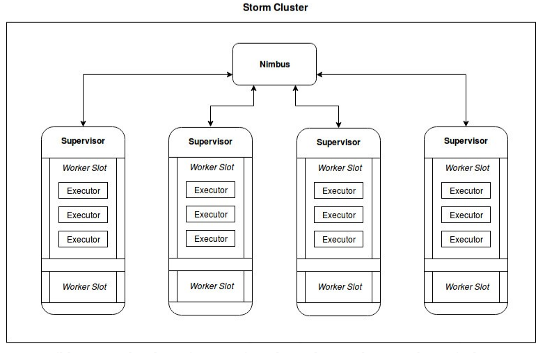
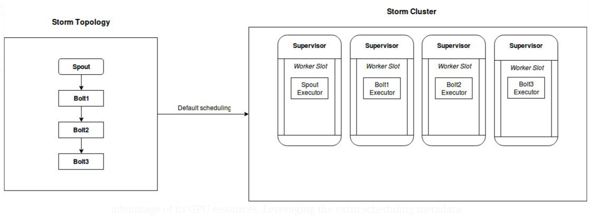
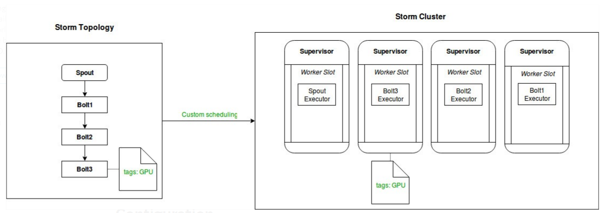
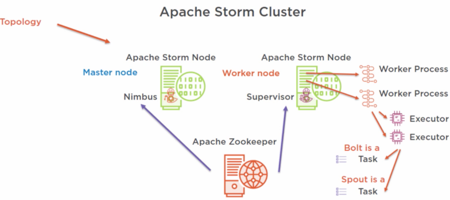
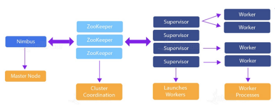
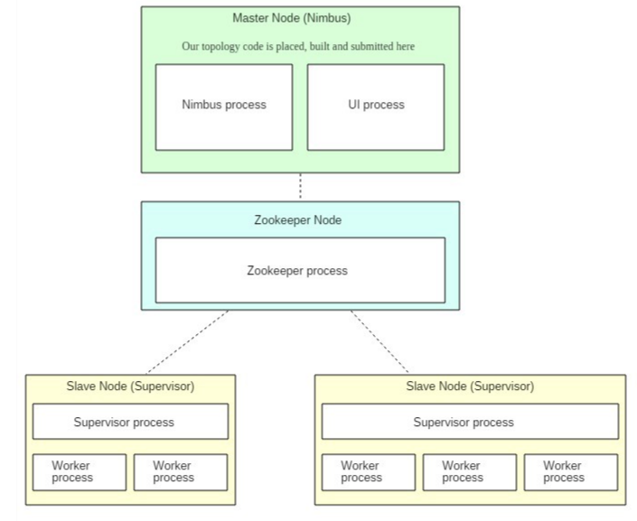

# Storm Cluster

A supervisor node is responsible for executing computation tasks as defined in a Storm topology’s spout and bolt components.

Each supervisor has a configurable number of worker slots which can be assigned (via the scheduler) an arbitrary amount of executors, which in turn correspond to topology component threads.

A worker slot can only house executors of a single topology.





If we take an example topology that looks as below and assume a cluster with four supervisors, the default scheduler will place a single component executor on each supervisor, taking up one slot on each.






You will notice three things highlighted in the image above, which are the necessary pieces to any custom scheduling:
- config at component level
- config at supervisor level
- custom scheduling logic


## a running topology

The following illustration shows how a simple topology would look like in operation. The topology consists of three components: one spout called BlueSpout and two bolts called GreenBolt and YellowBolt. The components are linked such that BlueSpout sends its output to GreenBolt, which in turns sends its own output to YellowBolt.


- Tuple

A named list of values of any data type. The native data structure used by Storm.

- Stream

An unbounded sequence of tuples.

- Spout

Generates a stream from a realtime data source.

- Bolt

Contains data processing, persistence, and messaging alert logic. Can also emit tuples for downstream bolts.

- Stream Grouping

Controls the routing of tuples to bolts for processing.

- Topology

A group of spouts and bolts wired together into a workflow. A Storm application.

- Processing Reliability

Storm guarantee about the delivery of tuples in a topology.

- Workers

A Storm process. A worker may run one or more executors.

- Executors

A Storm thread launched by a Storm worker. An executor may run one or more tasks.

- Tasks

A Storm job from a spout or bolt.


## How to change the parallelism of a running topology

A nifty feature of Storm is that you can increase or decrease the number of worker processes and/or executors without being required to restart the cluster or the topology. The act of doing so is called rebalancing.

You have two options to rebalance a topology:

- Use the Storm web UI to rebalance the topology.
- Use the CLI tool storm rebalance as described below.
- Here is an example of using the CLI tool:
```shell
## Reconfigure the topology "mytopology" to use 5 worker processes,
## the spout "blue-spout" to use 3 executors and
## the bolt "yellow-bolt" to use 10 executors.

$ storm rebalance mytopology -n 5 -e blue-spout=3 -e yellow-bolt=10
```








