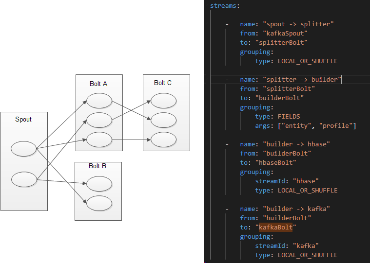

# Understanding the Internal Message Buffers of Storm

http://www.michael-noll.com/blog/2013/06/21/understanding-storm-internal-message-buffers/

https://www.cnblogs.com/ahu-lichang/p/6901530.html

# Storm Stream Groupings

http://www.corejavaguru.com/bigdata/storm/stream-groupings

StormTopology分组方式Stream Groupings

Stream Grouping定义了一个流在Bolt任务间该如何被切分。这里有Storm提供的6个Stream Grouping类型

1. 随机分组（Shuffle grouping）

随机分发tuple到Bolt的任务，保证每个任务获得相等数量的tuple。

2. 字段分组（Fields grouping）

根据指定字段分割数据流，并分组。例如，根据“user-id”字段，相同“user-id”的元组总是分发到同一个任务，不同“user-id”的元组可能分发到不同的任务。

3. 全部分组（All grouping）

tuple被复制到bolt的所有任务。这种类型需要谨慎使用。

4. 全局分组（Global grouping）

全部流都分配到bolt的同一个任务。明确地说，是分配给ID最小的那个task。

5. 无分组（None grouping）

你不需要关心流是如何分组。目前，无分组等效于随机分组。但最终，Storm将把无分组的Bolts放到Bolts或Spouts订阅它们的同一线程去执行（如果可能）。

6. 直接分组（Direct grouping）

这是一个特别的分组类型。元组生产者决

# Stream 流

 topology内部  spout和bolt直接使用OutCollector来发生线程间消息。
 
 OutCollector使用LMAX distributor 库来发送消息。

通过在topology中定义stream， 来连接spout和bolt。  

 
