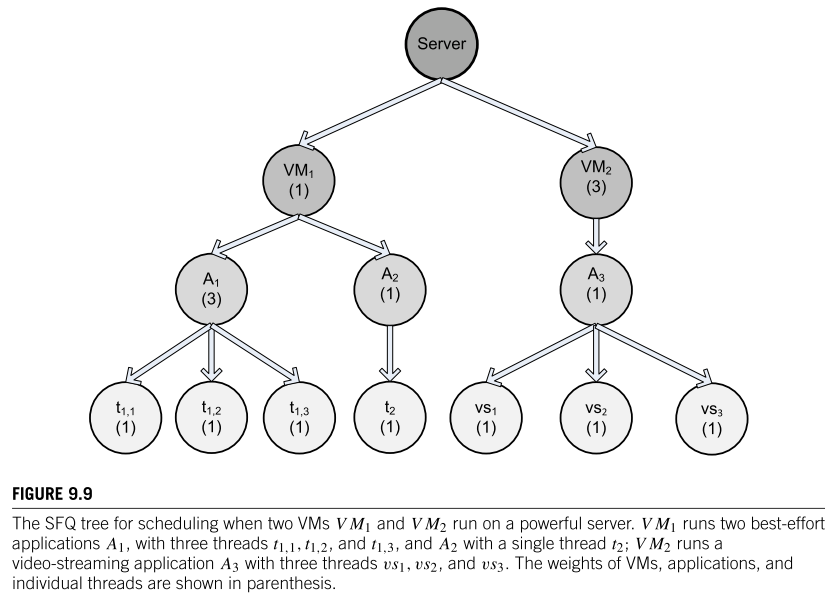

# Resource Scheduler
资源调度器

目前Hadoop有三种比较流行的资源调度器：FIFO 、Capacity Scheduler、Fair Scheduler。目前hadoop2.7默认使用的是Capacity Scheduler容量调度器。

## 容量调度器Capacity Scheduler

hadoop2.x使用的默认调度器是Capacity Scheduler。

1、支持多个队列，每个队列可配置一定量的资源，每个采用FIFO的方式调度。

2、为了防止同一个用户的job任务独占队列中的资源，调度器会对同一用户提交的job任务所占资源进行限制。

3、分配新的job任务时，首先计算每个队列中正在运行task个数与其队列应该分配的资源量做比值，然后选择比值最小的队列。比如如图队列A15个task，20%资源量，那么就是15%0.2=70，队列B是25%0.5=50 ，队列C是25%0.3=80.33 。所以选择最小值队列B。

4、其次，按照job任务的优先级和时间顺序，同时要考虑到用户的资源量和内存的限制，对队列中的job任务进行排序执行。

5、多个队列同时按照任务队列内的先后顺序一次执行。例如下图中job11、job21、job31分别在各自队列中顺序比较靠前，三个任务就同时执行。

The CapacityScheduler allows multiple-tenants to securely share a large Hadoop cluster. It is designed to run Hadoop applications in a shared, multi-tenant cluster while maximizing the throughput and the utilization of the cluster.

It supports hierarchical queues to reflect the structure of organizations or groups that utilizes the cluster resources. A queue hierarchy contains three types of queues that are root, parent, and leaf.

 
The root queue represents the cluster itself, parent queue represents organization/group or sub-organization/sub-group, and the leaf accepts application submission.

The Capacity Scheduler allows the sharing of the large cluster while giving capacity guarantees to each organization by allocating a fraction of cluster resources to each queue.

Also, when there is a demand for the free resources that are available on the queue who has completed its task, by the queues running below capacity, then these resources will be assigned to the applications on queues running below capacity. This provides elasticity for the organization in a cost-effective manner.

Apart from it, the CapacityScheduler provides a comprehensive set of limits to ensure that a single application/user/queue cannot use a disproportionate amount of resources in the cluster.

To ensure fairness and stability, it also provides limits on initialized and pending apps from a single user and queue.

Advantages:

It maximizes the utilization of resources and throughput in the Hadoop cluster.
Provides elasticity for groups or organizations in a cost-effective manner.

 
It also gives capacity guarantees and safeguards to the organization utilizing cluster.

Disadvantage:

It is complex amongst the other scheduler.

## FIFO（先入先出调度器）

hadoop1.x使用的默认调度器就是FIFO。FIFO采用队列方式将一个一个job任务按照时间先后顺序进行服务。比如排在最前面的job需要若干maptask和若干reducetask，当发现有空闲的服务器节点就分配给这个job，直到job执行完毕。

## Fair Scheduler（公平调度器）

1、支持多个队列，每个队列可以配置一定的资源，每个队列中的job任务公平共享其所在队列的所有资源。

2、队列中的job任务都是按照优先级分配资源，优先级越高分配的资源越多，但是为了确保公平每个job任务都会分配到资源。优先级是根据每个job任务的理想获取资源量减去实际获取资源量的差值决定的，差值越大优先级越高。

from https://data-flair.training/blogs/hadoop-schedulers/

FairScheduler allows YARN applications to fairly share resources in large Hadoop clusters. With FairScheduler, there is no need for reserving a set amount of capacity because it will dynamically balance resources between all running applications.

It assigns resources to applications in such a way that all applications get, on average, an equal amount of resources over time.

 
The FairScheduler, by default, takes scheduling fairness decisions only on the basis of memory. We can configure it to schedule with both memory and CPU.

When the single application is running, then that app uses the entire cluster resources. When other applications are submitted, the free up resources are assigned to the new apps so that every app eventually gets roughly the same amount of resources. FairScheduler enables short apps to finish in a reasonable time without starving the long-lived apps.

Similar to CapacityScheduler, the FairScheduler supports hierarchical queue to reflect the structure of the long shared cluster.

Apart from fair scheduling, the FairScheduler allows for assigning minimum shares to queues for ensuring that certain users, production, or group applications always get sufficient resources. When an app is present in the queue, then the app gets its minimum share, but when the queue doesn’t need its full guaranteed share, then the excess share is split between other running applications.

Advantages:

It provides a reasonable way to share the Hadoop Cluster between the number of users.
Also, the FairScheduler can work with app priorities where the priorities are used as weights in determining the fraction of the total resources that each application should get.
Disadvantage:

It requires configuration.

## HaSTE: Hadoop YARN Scheduling Based on Task-Dependency and Resource-Demand

https://sites.google.com/site/jiayinatumb/research/haste

The Problem:

The Hadoop ecosystem has evolved into its second generation, Hadoop YARN, which adopts fine grained resource management schemes for job scheduling. In YARN, there is no “slot” which is the building block in the old versions, and the system no longer distinguishes map and reduce tasks when allocating resources. Instead, each task specifies a resource request in the form of <2G,1core> (i.e., requesting 2G memory and 1 cpu core), and it will be assigned to a node with sufficient capacity. However, existing schedulers in YARN don't consider the efficiency of resource utilization for multiple jobs running concurrently in cluster.

Our Solution:

Motivated by above problem, we propose a new Hadoop YARN scheduling algorithm, named HaSTE, which aims at efficiently utilizing the resources for scheduling map/reduce tasks in Hadoop YARN and improving the makespan of MapReduce jobs. Specifically, our solution dynamically schedules tasks for execution when resources become available based on two metrics of each task:
Fitness: 
        Fitness is the metric for resource demands of tasks. It essentially refers to the gap between the resource demand of tasks and the residual resource capacity of nodes. We use the First Fit Decreasing (FFD) algorithm to calculate the fitness score of each task based on their resource demand and the  remaining resource on the node.

        Furthmore, we adopt the FFD-DP method to schedule map and reduce tasks with two resource requirements: memory and cpu.

Urgency: 
         Urgency is the metric for dependency between tasks. It is designed to quantify the "importance" of a task in the entire process. It allows us to            prioritize all the tasks from different jobs and more importantly, catches the dependency between tasks. Three conditions are take into                      consideration for the calculation of the urgency of each task:
A job with more progress of map phase, will be more urgent to schedule its map tasks.
A job with more resources allocated to reduce tasks will be more urgent to schedule its map tasks.
Reduce tasks are more urgent than map tasks if its resource occupancy rate is lower than the map progress.
         Furthermore, we develop an aggregation function that combines the fitness and urgency to compare all candidate tasks and select the best             one for execution. 

The implementation of both HaSTE and FFD-DP are based on Hadoop YARN version: 2.2.0.

Publication :

HaSTE: Hadoop YARN Scheduling Based on Task-Dependency and Resource-Demand

[CLOUD'14 ] The 7th IEEE International Conference on Cloud Computing, Anchorage, AK, June 2014

## 

Step 1) Client ask ResourceManager to run an ApplicationMaster  
(Step 2a and 2b) ResourceManager find a NodeManager that can launch the ApplicationMaster in container.  
Once computing and return result to client.  
(Step 3) Or request more containers from ResourceManager.  
(Step 4a and 4b) From (Step 3) run a distributed computation, MapReduce  

## 多租户

CapacityScheduler是一个可插装的调度器，它的用途就是对多用户实现共享大集群并对每个用户资源占用做控制。

对于很豪的公司来说，每个用户(团队)自己有一个hadoop集群，这样可以提高自身的稳定性和资源供应，但是确降低了资源利用率，因为很多集群大多数时间都是空闲的。CapacityScheduler能实现这样的功能：每个组固定享有集群里的一部分资源，保证低保，同时如果这个固定的资源空闲，那么可以提供给其他组来抢占，但是一旦这些资源的固定使用者要用，那么立即释放给它使用。这种机制在实现上是通过queue（队列）来实现的。当然CapacityScheduler还支持子队列（sub-queue），

## 调度算法

• Class 1, with guaranteed latency and delivery  
• Class 2, with guaranteed delivery  
• Class 3, a best-effort service  

Weighted fair queuing (WFQ)  
Class-Based Weighted Fair Queuing, or CBWFQ

picture from  2017-Cloud Computing Theory and Practice

