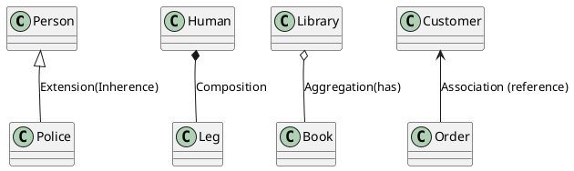
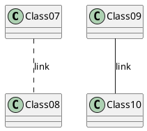
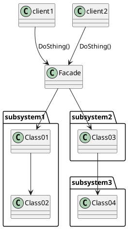
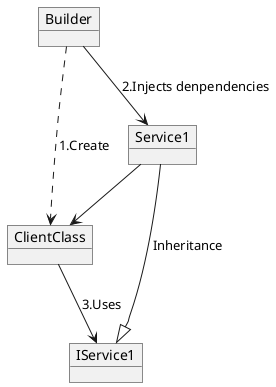
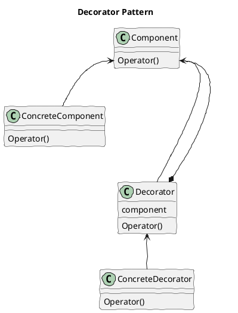

### Class Diagram Annotation

### Facade Pattern

### Dependency Injection
Dependency Injection (DI) is a software design pattern that implements inversion of control for resolving dependencies.

 - An injection is the passing of a dependency to a dependent object that would use it.
 - DI is a process whereby objects define their dependencies. The other objects they work with—only through constructor arguments or arguments to a factory method or property—are set on the object instance after it is constructed or returned from a factory method.

 - The container then injects those dependencies, and it creates the bean. This process is named Inversion of Control (IoC) (the bean itself controls the instantiation or location of its dependencies by using direct construction classes or a Service Locator).

 - DI refers to the process of supplying an external dependency to a software component.

###  Decorator Class Diagram
Decorator pattern introduces some boilerplate code to an existing class hierarchy. The pattern introduces a shared interface between the target class and the decorator. The decorator must have a reference to an instance of this interface.

