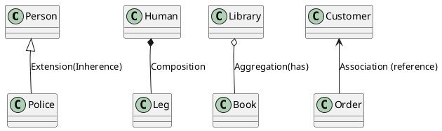
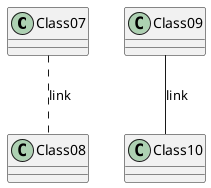
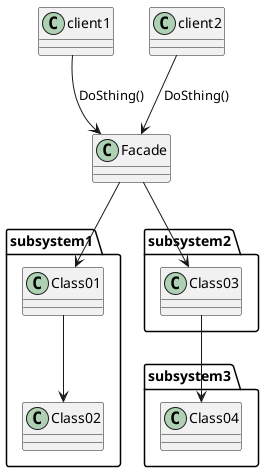
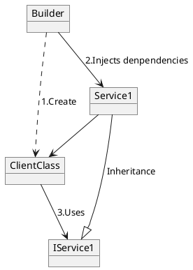
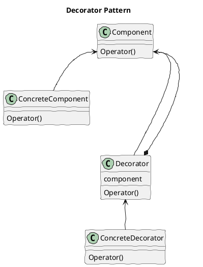
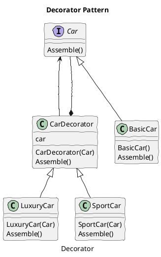

### Class Diagram Annotation






### Facade Pattern




### Dependency Injection
Dependency Injection (DI) is a software design pattern that implements inversion of control for resolving dependencies.

 - An injection is the passing of a dependency to a dependent object that would use it.
 - DI is a process whereby objects define their dependencies. The other objects they work with—only through constructor arguments or arguments to a factory method or property—are set on the object instance after it is constructed or returned from a factory method.

 - The container then injects those dependencies, and it creates the bean. This process is named Inversion of Control (IoC) (the bean itself controls the instantiation or location of its dependencies by using direct construction classes or a Service Locator).

 - DI refers to the process of supplying an external dependency to a software component.




###  Decorator Class Diagram
Decorator pattern introduces some boilerplate code to an existing class hierarchy. The pattern introduces a shared interface between the target class and the decorator. The decorator must have a reference to an instance of this interface.





Decorator design pattern is used to modify the functionality of an object at runtime. At the same time other instances of the same class will not be affected by this, so individual object gets the modified behavior. Decorator design pattern is one of the structural design pattern (such as Adapter Pattern, Bridge Pattern, Composite Pattern) and uses abstract classes or interface with composition to implement.


from：https://www.journaldev.com/1540/decorator-design-pattern-in-java-example

- Component Interface – The interface or abstract class defining the methods that will be implemented. In our case Car will be the component interface.
- Component Implementation – The basic implementation of the component interface. We can have BasicCar class as our component implementation.
- Decorator – Decorator class implements the component interface and it has a HAS-A relationship with the component interface. The component variable should be accessible to the child decorator classes, so we will make this variable protected.
- Concrete Decorators – Extending the base decorator functionality and modifying the component behavior accordingly. We can have concrete decorator classes as LuxuryCar and SportsCar.

Decorator Design Pattern – Important Points
 - Decorator design pattern is helpful in providing runtime modification abilities and hence more flexible. Its easy to maintain and extend when the number of choices are more.
 - The disadvantage of decorator design pattern is that it uses a lot of similar kind of objects (decorators).
 - Decorator pattern is used a lot in Java IO classes, such as FileReader, BufferedReader etc.


### Mediator Pattern

Mediator design pattern is used to collaborate a set of colleagues. Those colleagues do not communicate with each other directly, but through the mediator.

from https://www.programcreek.com/2012/08/java-design-pattern-template-method/

 

```java
package designpatterns.mediator;
 
interface IMediator {
	public void fight();
	public void talk();
	public void registerA(ColleagueA a);
	public void registerB(ColleagueB a);
}
 
//concrete mediator
class ConcreteMediator implements IMediator{
 
	ColleagueA talk;
	ColleagueB fight;
 
	public void registerA(ColleagueA a){
		talk = a;
	}
 
	public void registerB(ColleagueB b){
		fight = b;
	}
 
	public void fight(){
		System.out.println("Mediator is fighting");
		//let the fight colleague do some stuff
	}
 
	public void talk(){
		System.out.println("Mediator is talking");
		//let the talk colleague do some stuff
	}
}
 
abstract class Colleague {
	IMediator mediator;
	public abstract void doSomething();
}
 
//concrete colleague
class ColleagueA extends Colleague {
 
	public ColleagueA(IMediator mediator) {
		this.mediator = mediator;
	}
 
	@Override
	public void doSomething() {
		this.mediator.talk();
		this.mediator.registerA(this);
	}
}
 
//concrete colleague
class ColleagueB extends Colleague {
	public ColleagueB(IMediator mediator) {
		this.mediator = mediator;
		this.mediator.registerB(this);
	}
 
	@Override
	public void doSomething() {
		this.mediator.fight();
	}
}
 
public class MediatorTest {
	public static void main(String[] args) {
		IMediator mediator = new ConcreteMediator();
 
		ColleagueA talkColleague = new ColleagueA(mediator);
		ColleagueB fightColleague = new ColleagueB(mediator);
 
		talkColleague.doSomething();
		fightColleague.doSomething();
	}
}
```

---


### Filter Pattern
The intercepting filter design pattern is used when we want to do some pre-processing / post-processing with request or response of the application. Filters are defined and applied on the request before passing the request to actual target application. Filters can do the authentication/ authorization/ logging or tracking of request and then pass the requests to corresponding handlers. Following are the entities of this type of design pattern

- Filter - Filter which will performs certain task prior or after execution of request by request handler.

- Filter Chain - Filter Chain carries multiple filters and help to execute them in defined order on target.

- Target - Target object is the request handler

- Filter Manager - Filter Manager manages the filters and Filter Chain.

- Client - Client is the object who sends request to the Target object.


