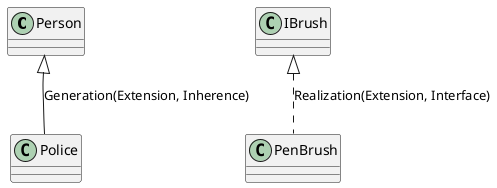
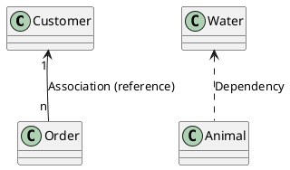
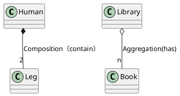
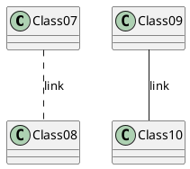
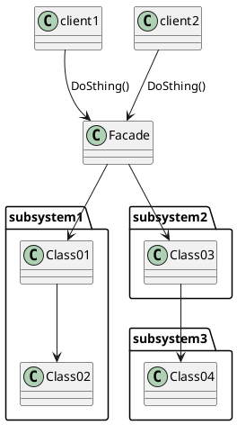
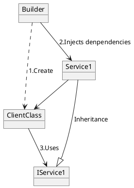
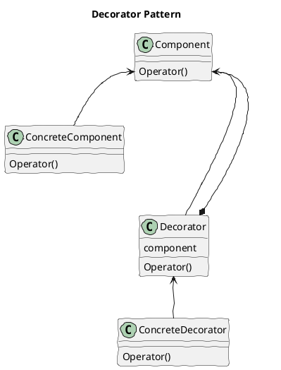
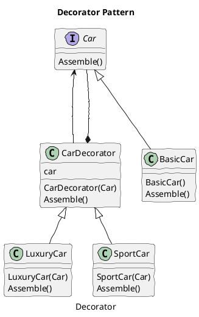
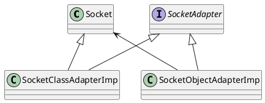

Design Patterns
## Java Design Patterns
 - Creational Pattern(5)
   - Factory Method Pattern
   - Abstract Factory Pattern
   - Singleton Pattern
   - Prototype Pattern
   - Builder Pattern
   - ***Object Pool Pattern***
 - Structural Pattern(7)
   - Adapter Pattern
   - Bridge Pattern
   - Composite Pattern
   - Decorator Pattern
   - Facade Pattern
   - Flyweight Pattern
   - proxy Pattern
 - Behavioral Pattern(11)
   - Chain of Responsibility
   - Command Pattern
   - Interpreter Pattern
   - Iterator Pattern
   - Mediator Pattern
   - Memento Pattern
   - Observer Pattern
   - State Pattern
   - Strategy Pattern
   - Template Pattern
   - Vistor Pattern
 - J2EE Patterns
   - JEE or J2EE Patterns
Presentation Layer
Intercepting Filter PatternFront Controller Patternv

https://www.javatpoint.com/design-patterns-in-java

### 设计模式的六大原则

总原则：开闭原则（Open Close Principle）

开闭原则就是说对扩展开放，对修改关闭。在程序需要进行拓展的时候，不能去修改原有的代码，而是要扩展原有代码，实现一个热插拔的效果。所以一句话概括就是：为了使程序的扩展性好，易于维护和升级。想要达到这样的效果，我们需要使用接口和抽象类等，后面的具体设计中我们会提到这点。

1、单一职责原则

不要存在多于一个导致类变更的原因，也就是说每个类应该实现单一的职责，如若不然，就应该把类拆分。

 

2、里氏替换原则（Liskov Substitution Principle）

里氏代换原则(Liskov Substitution Principle LSP)面向对象设计的基本原则之一。 里氏代换原则中说，任何基类可以出现的地方，子类一定可以出现。 LSP是继承复用的基石，只有当衍生类可以替换掉基类，软件单位的功能不受到影响时，基类才能真正被复用，而衍生类也能够在基类的基础上增加新的行为。里氏代换原则是对“开-闭”原则的补充。实现“开-闭”原则的关键步骤就是抽象化。而基类与子类的继承关系就是抽象化的具体实现，所以里氏代换原则是对实现抽象化的具体步骤的规范。—— From Baidu 百科

历史替换原则中，子类对父类的方法尽量不要重写和重载。因为父类代表了定义好的结构，通过这个规范的接口与外界交互，子类不应该随便破坏它。

 

3、依赖倒转原则（Dependence Inversion Principle）

这个是开闭原则的基础，具体内容：面向接口编程，依赖于抽象而不依赖于具体。写代码时用到具体类时，不与具体类交互，而与具体类的上层接口交互。

 

4、接口隔离原则（Interface Segregation Principle）

这个原则的意思是：每个接口中不存在子类用不到却必须实现的方法，如果不然，就要将接口拆分。使用多个隔离的接口，比使用单个接口（多个接口方法集合到一个的接口）要好。

 

5、迪米特法则（最少知道原则）（Demeter Principle）

就是说：一个类对自己依赖的类知道的越少越好。也就是说无论被依赖的类多么复杂，都应该将逻辑封装在方法的内部，通过public方法提供给外部。这样当被依赖的类变化时，才能最小的影响该类。

最少知道原则的另一个表达方式是：只与直接的朋友通信。类之间只要有耦合关系，就叫朋友关系。耦合分为依赖、关联、聚合、组合等。我们称出现为成员变量、方法参数、方法返回值中的类为直接朋友。局部变量、临时变量则不是直接的朋友。我们要求陌生的类不要作为局部变量出现在类中。

 

6、合成复用原则（Composite Reuse Principle）

原则是尽量首先使用合成/聚合的方式，而不是使用继承。

### Class Diagram Annotation









### Facade Pattern




### Dependency Injection
Dependency Injection (DI) is a software design pattern that implements inversion of control for resolving dependencies.

 - An injection is the passing of a dependency to a dependent object that would use it.
 - DI is a process whereby objects define their dependencies. The other objects they work with—only through constructor arguments or arguments to a factory method or property—are set on the object instance after it is constructed or returned from a factory method.

 - The container then injects those dependencies, and it creates the bean. This process is named Inversion of Control (IoC) (the bean itself controls the instantiation or location of its dependencies by using direct construction classes or a Service Locator).

 - DI refers to the process of supplying an external dependency to a software component.




###  Decorator Class Diagram
Decorator pattern introduces some boilerplate code to an existing class hierarchy. The pattern introduces a shared interface between the target class and the decorator. The decorator must have a reference to an instance of this interface.





Decorator design pattern is used to modify the functionality of an object at runtime. At the same time other instances of the same class will not be affected by this, so individual object gets the modified behavior. Decorator design pattern is one of the structural design pattern (such as Adapter Pattern, Bridge Pattern, Composite Pattern) and uses abstract classes or interface with composition to implement.


from：https://www.journaldev.com/1540/decorator-design-pattern-in-java-example

- Component Interface – The interface or abstract class defining the methods that will be implemented. In our case Car will be the component interface.
- Component Implementation – The basic implementation of the component interface. We can have BasicCar class as our component implementation.
- Decorator – Decorator class implements the component interface and it has a HAS-A relationship with the component interface. The component variable should be accessible to the child decorator classes, so we will make this variable protected.
- Concrete Decorators – Extending the base decorator functionality and modifying the component behavior accordingly. We can have concrete decorator classes as LuxuryCar and SportsCar.

Decorator Design Pattern – Important Points
 - Decorator design pattern is helpful in providing runtime modification abilities and hence more flexible. Its easy to maintain and extend when the number of choices are more.
 - The disadvantage of decorator design pattern is that it uses a lot of similar kind of objects (decorators).
 - Decorator pattern is used a lot in Java IO classes, such as FileReader, BufferedReader etc.

### Adapter Pattern
https://www.journaldev.com/1487/adapter-design-pattern-java
Adapter design pattern is one of the structural design pattern and its used so that two unrelated interfaces can work together. The object that joins these unrelated interface is called an Adapter.
 - Two Way Adapter Pattern
While implementing Adapter pattern, there are two approaches – class adapter and object adapter – however both these approaches produce same result.

**Class Adapter** – This form uses java inheritance and extends the source interface, in our case Socket class.
**Object Adapter** – This form uses Java Composition and adapter contains the source object.




### Mediator Pattern

Mediator design pattern is used to collaborate a set of colleagues. Those colleagues do not communicate with each other directly, but through the mediator.

from https://www.programcreek.com/2012/08/java-design-pattern-template-method/

 

```java
package designpatterns.mediator;
 
interface IMediator {
	public void fight();
	public void talk();
	public void registerA(ColleagueA a);
	public void registerB(ColleagueB a);
}
 
//concrete mediator
class ConcreteMediator implements IMediator{
 
	ColleagueA talk;
	ColleagueB fight;
 
	public void registerA(ColleagueA a){
		talk = a;
	}
 
	public void registerB(ColleagueB b){
		fight = b;
	}
 
	public void fight(){
		System.out.println("Mediator is fighting");
		//let the fight colleague do some stuff
	}
 
	public void talk(){
		System.out.println("Mediator is talking");
		//let the talk colleague do some stuff
	}
}
 
abstract class Colleague {
	IMediator mediator;
	public abstract void doSomething();
}
 
//concrete colleague
class ColleagueA extends Colleague {
 
	public ColleagueA(IMediator mediator) {
		this.mediator = mediator;
	}
 
	@Override
	public void doSomething() {
		this.mediator.talk();
		this.mediator.registerA(this);
	}
}
 
//concrete colleague
class ColleagueB extends Colleague {
	public ColleagueB(IMediator mediator) {
		this.mediator = mediator;
		this.mediator.registerB(this);
	}
 
	@Override
	public void doSomething() {
		this.mediator.fight();
	}
}
 
public class MediatorTest {
	public static void main(String[] args) {
		IMediator mediator = new ConcreteMediator();
 
		ColleagueA talkColleague = new ColleagueA(mediator);
		ColleagueB fightColleague = new ColleagueB(mediator);
 
		talkColleague.doSomething();
		fightColleague.doSomething();
	}
}
```

---


### Filter Pattern
The intercepting filter design pattern is used when we want to do some pre-processing / post-processing with request or response of the application. Filters are defined and applied on the request before passing the request to actual target application. Filters can do the authentication/ authorization/ logging or tracking of request and then pass the requests to corresponding handlers. Following are the entities of this type of design pattern

- Filter - Filter which will performs certain task prior or after execution of request by request handler.

- Filter Chain - Filter Chain carries multiple filters and help to execute them in defined order on target.

- Target - Target object is the request handler

- Filter Manager - Filter Manager manages the filters and Filter Chain.

- Client - Client is the object who sends request to the Target object.


---
- Custom Filter Strategy
https://www.baeldung.com/intercepting-filter-pattern-in-java

The custom filter strategy is used in every use case that requires an ordered processing of requests, in the meaning of one filter is based on the results of a previous filter in an execution chain.

These chains will be created by implementing the FilterChain interface and registering various Filter classes with it.

When using multiple filter chains with different concerns, you can join them together in a filter manager:

- Base Filter Strategy
This strategy plays nicely together with the custom strategy from the previous section or with the Standard Filter Strategy that we’ll introduce in the next section.

The abstract base class can be used to apply custom behavior that belongs to a filter chain. We’ll use it in our example to reduce boilerplate code related to filter configuration and debug logging:

```JAVA
public abstract class BaseFilter implements Filter {
    private Logger log = LoggerFactory.getLogger(BaseFilter.class);
 
    protected FilterConfig filterConfig;
 
    @Override
    public void init(FilterConfig filterConfig) throws ServletException {
        log.info("Initialize filter: {}", getClass().getSimpleName());
        this.filterConfig = filterConfig;
    }
 
    @Override
    public void destroy() {
        log.info("Destroy filter: {}", getClass().getSimpleName());
    }
}
//Let’s extend this base class to create a request logging filter, which will be integrated into the next section:

public class LoggingFilter extends BaseFilter {
    private static final Logger log = LoggerFactory.getLogger(LoggingFilter.class);
 
    @Override
    public void doFilter(
      ServletRequest request, 
      ServletResponse response,
      FilterChain chain) {
        chain.doFilter(request, response);
        HttpServletRequest httpServletRequest = (HttpServletRequest) request;
         
        String username = Optional
          .ofNullable(httpServletRequest.getAttribute("username"))
          .map(Object::toString)
          .orElse("guest");
         
        log.info(
          "Request from '{}@{}': {}?{}", 
          username, 
          request.getRemoteAddr(),
          httpServletRequest.getRequestURI(), 
          request.getParameterMap());
    }
}
```

- Standard Filter Strategy
A more flexible way of applying filters is to implement the Standard Filter Strategy. This can be done by declaring filters in a deployment descriptor or, since Servlet specification 3.0, by annotation.

The standard filter strategy allows to plug-in new filters into a default chain without having an explicitly defined filter manager


- Template Filter Strategy
The Template Filter Strategy is pretty much the same as the base filter strategy, except that it uses template methods declared in the base class that must be overridden in implementations


