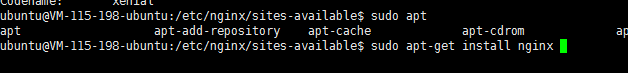
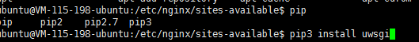
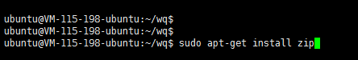
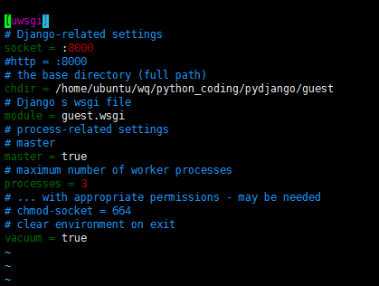
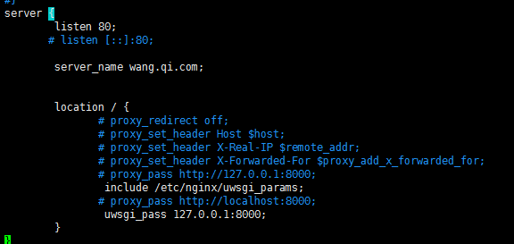
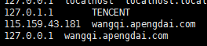

#### ubuntu 16.04部署python项目（Nginx+uwsgi+django）
尝试在linux上部署项目，先从最熟悉的python项目开始吧。

##### 1、安装Nginx

命令:sudo apt-get install nginx

##### 2、安装uwsgi，从pip仓库安装

命令：pip3 install uwsgi

 

##### 3、把django项目移到服务器

通过这次操作才知道往linux上拖文件不能拖文件。因此需要打包一下才能移动文件。我这个云服务器默认支持的xxx.tar.gz格式的文件，但是在windows上压缩的时候只能压缩成zip的，所以这里有两个办法

1）在windows上安装一个好压的软件，然后把文件压缩成xxx.tar.gz格式，然后在linux上就可以直接tar -zxvf xx.tar.gz就可以了

2）在云服务器上安装zip命令，sudo apt-get install zip:

然后用zip命令解压我们在windows下压缩好的包

unzip xxx.zip   解压文件

unzip -v xxx.zip 查看文件内容，但不解压

unzip file.zip -d/目录名  把file解压到制定目录

zip -r xxxx.zip   yyy 把yyy以及yyy下面的所有文件都压缩成xxxx.zip文件

##### 4、配置Nginx与uwsgi

在与manager同级目录下创建uwsgi.ini 文件，文件内容如下：

socket与http要注意，如果是要用Nginx运行django的话，就用socket，如果用uwsgi运行django的话，这里就要换成http。

Nginx配置如下，在nginx.conf中的http加入server，如下

 

 

##### 问题1：安装pip

我用的是腾讯云服务器，系统是自带python的，但是pip需要自己安装，安装的过程也有点小曲折，故记录一下。

命令：sudo apt-get python3-pip 安装pip3

sudo apt-get python2-pip 安装pip2

安装的时候按照下面的方法，但是都是安装的python2的，python3的没有安装成功，因为我项目用的是python3，所以用上面的方法能安装成功也就不纠结这个了。

Install Easy Install

$ sudo apt-get install python-setuptools python-dev build-essential 

Install pip

$ sudo easy_install pip 

##### 问题2、配置nginx

配置nginx的时候想配置自己的域名玩玩，刚开始不知道，以为只要在server_name配上自己的域名就可以，结果肯定是一直失败，请求都到不了nginx。

在网上找了好多资料加上运维同学的讲解才明白，要使用自己配置的域名，需要在服务器（也就是linux主机）上的hosts加入自己配置的域名并映射ip

，然后还要在客户机（就是我们访问服务器的机器）的hosts文件中加上域名与ip的映射，我的是windows，默认都是在c盘中。

