```puml
@startuml;

[*] --> State1;
State1 --> [*];
State1 : this is a string;
State1 : this is another string;

State1 -> State2;
State2 --> [*];

@enduml
```

\[ z = \frac{1}{x^2+y^2} \]


```sequence{theme=hand}
Andrew->China: Says Hello
Note right of China: China thinks\nabout it
China-->Andrew: How are you?
Andrew->>China: I am good thanks!
```




```puml
@startuml  mychart
start
:dosomtething;
if (cond?) then (val1)
    :dosomtething;
else (val2)
    :dosomtething;
endif
:画;
:dosomtething;
end
@enduml
```

### C4-PlantUML
https://github.com/RicardoNiepel/C4-PlantUML

XXX.puml

@startuml LAYOUT_AS_SKETCH Sample
!includeurl file:///E:/Document/C4_Container.puml


LAYOUT_AS_SKETCH

Person(admin, "Administrator")
package "Sample System" <<boundary>> as c1 {
    Container(web_app, "Web Application", "C#, ASP.NET Core 2.1 MVC", "Allows users to compare multiple Twitter timelines")
}
System(twitter, "Twitter")

Rel(admin, web_app, "Uses", "HTTPS")
Rel(web_app, twitter, "Gets tweets from", "HTTPS")
@enduml
