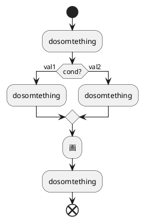
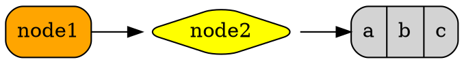
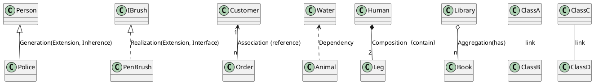

@startuml;

[*] --> State1;
State1 --> [*];
State1 : this is a string;
State1 : this is another string;

State1 -> State2;
State2 --> [*];

@enduml


```sequence{theme=hand}
Andrew->China: Says Hello
Note right of China: China thinks\nabout it
China-->Andrew: How are you?
Andrew->>China: I am good thanks!
```









