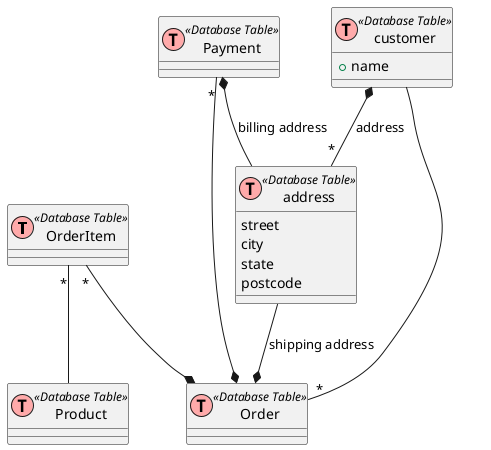

## Example of Aggregation Model

### 6 Rules of Thumb for MongoDB Schema Design
https://www.mongodb.com/blog/post/6-rules-of-thumb-for-mongodb-schema-design-part-1
https://www.mongodb.com/blog/post/6-rules-of-thumb-for-mongodb-schema-design-part-2

### NOSQL DATA MODELING TECHNIQUES
https://highlyscalable.wordpress.com/2012/03/01/nosql-data-modeling-techniques/

### Data Modeling Guidelines for NoSQL JSON Document Databases
https://mapr.com/blog/data-modeling-guidelines-nosql-json-document-databases/

### NoSQL Data Modeling
https://www.ebayinc.com/stories/blogs/tech/nosql-data-modeling/

### 
